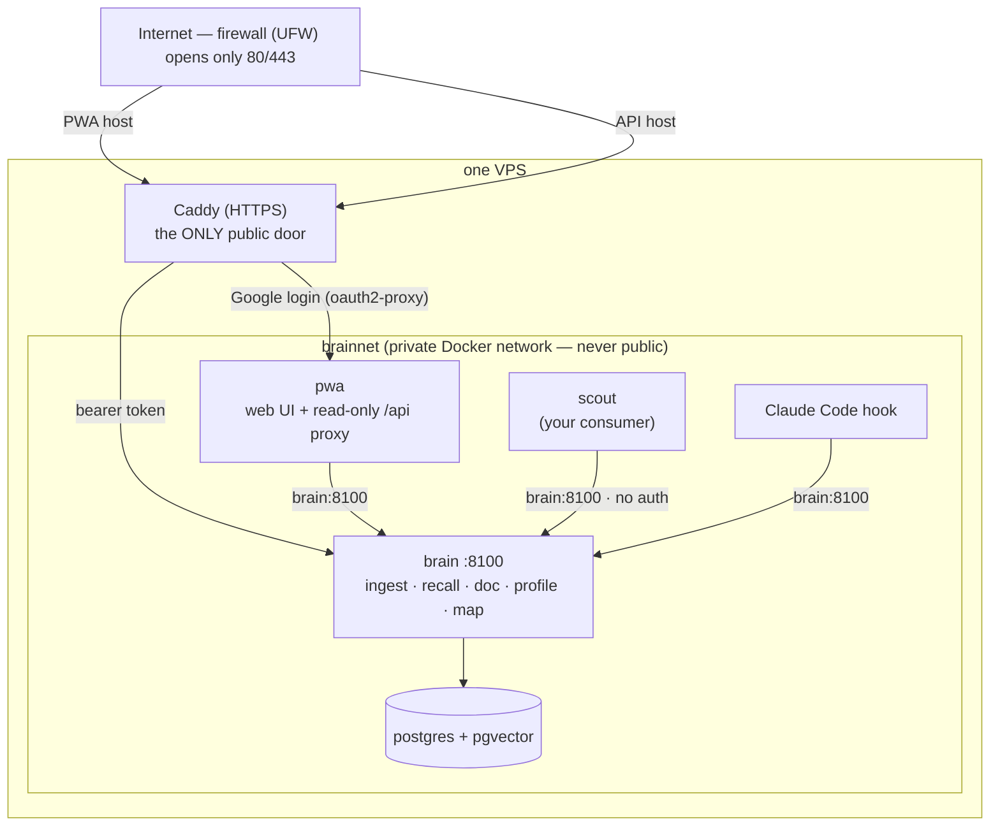

# brainbot

A self-hosted **control plane for personal apps**. **One shared brain, one sign-in, one design system — so every app you build stays small.**

Brainbot is a four-layer platform. The bottom layer is the brain; the layers above turn "I want to build another little app for myself" into a repeatable contract instead of a fresh stack each time:

```
L4  apps        scout · job-fit scorer · reading-triage · …   (each: own backend + own PWA, own repo)
L3  web-toolkit shared frontend package — design tokens, app shell, service-worker + manifest, brain client, session
L2  edge        Caddy + oauth2-proxy: HTTPS + Google SSO, one vhost per app
L1  brain       Postgres + pgvector over HTTP/MCP — the shared knowledge substrate
```

L1 and L2 were already built; L3 (the web-toolkit) and the apps launcher are the new pieces that make app N+1 cheap. The full design is in [`docs/app-platform.md`](./docs/app-platform.md).

**The brain (L1)** is a **Postgres + pgvector document store**: your human-edited pages (Notion today) are ingested as canonical **sources**, split into embedded section **chunks**, and served back over HTTP + MCP via three consumer reads — `recall(query)` (hybrid search), `doc(id)` (deterministic whole-document fetch), and `map()` (discovery). There is no graph DB and no write-time LLM — embedding is the only external call at ingest, and editing the brain means editing the source page.

**An app (L4)** is a small contract: *a backend that owns its own working-set data and reads the brain read-only over HTTP, **+** a PWA built from the web-toolkit, **+** one vhost behind the shared edge.* Backends are **polyglot on purpose** — the brain is Python, scout is Go, the next thing might be 200 lines of Node. What makes them feel like one product is the shared edge, the shared toolkit, and the shared brain — not a shared runtime.

Concrete example: keep your work history + the kind of roles you'd consider in Notion, ingest those pages, and build a separate app that scores incoming job listings against what the brain actually knows about you — no per-app profile, same Google login, same skin, for free. That one is [worked through in full below](#use-cases-worked-through), alongside two others.

Two first-party apps ship with the project, both as worked examples:

- **Claude Code MCP** — terminal harness in any project repo. A `UserPromptSubmit` hook injects relevant brain context into every prompt. (A pure consumer — no PWA.)
- **PWA** — a phone surface, Google-auth'd at the edge: dashboard, recall search, source map, Notion discovery + selective ingest, in-app docs, and an **#apps launcher** that lists your apps with a per-card health ping. It is itself the first app built on the web-toolkit.

## What it's for

The intent is **personal context as infrastructure, and a repeatable shape for the apps that use it**:

- **One brain, many apps.** Every app you build — job scorer, calendar prep, reading triage — needs to know things about you. Instead of each app keeping its own profile, config, or notes copy, they all query one service that holds the knowledge.
- **Two kinds of data, never mixed.** Knowledge *about you* (preferences, history, who you've met) lives in the brain — shared, system of record. An app's *working set* (scout's verdicts, a reader queue's read/unread) lives in the app's own store. The brain is read-only for consumers; an app never writes its tables into the brain's dataset.
- **You curate the truth; the machine derives the index.** The brain never invents or accumulates memory on its own. You write and edit normal pages (Notion today); ingest splits and embeds them. Editing the brain *is* editing the page — no automatic extraction, no memory that drifts from what you wrote.
- **The brain retrieves; your app reasons.** Queries return faithful passages from your pages (a librarian), never synthesized answers (an oracle). Interpretation, gates, and decisions belong to the app.
- **Build app N+1 without inventing a stack.** The edge gives every app HTTPS + SSO; the web-toolkit gives every app the same design, shell, service worker, and brain client. PWA-ness is free; auth lives at the edge, not in the app.
- **Self-hosted and owned end to end.** Storage, retrieval pipeline, edge, and apps run on your box. The only external call is embeddings, and the embedder is pluggable.
- **Single-user by design.** A platform for one person, shared across that person's apps — not a team knowledge base.

The platform design lives in [`docs/app-platform.md`](./docs/app-platform.md) and [`docs/web-toolkit.md`](./docs/web-toolkit.md); the brain itself in [`docs/architecture.md`](./docs/architecture.md); the full doc set is indexed at [`docs/README.md`](./docs/README.md); how the design got here is the append-only [`docs/learnings.md`](./docs/learnings.md). To scaffold a new app, the `build-platform-app` skill walks the contract end to end.

## Developing on the platform: what you get for free

The whole point of the four layers is that **an app author writes almost nothing but the app.** Everything that is the same for every personal app — sign-in, HTTPS, the look, the offline shell, install-to-home-screen, and the connection to your knowledge — is *inherited*, not rebuilt each time.

There are two shapes of consumer. A **pure consumer** (a script, a shell hook, an LLM tool) is anything that can make an HTTP call; it just reads the brain and is done. A **platform app** adds a face: a backend in any language plus a PWA built from the web-toolkit. For a platform app, here is the entire division of labor:

| You write | The platform gives you, unchanged |
|---|---|
| your backend's `/api/*` — its own logic + working-set store, in **any language** | a real HTTPS origin + Google SSO at the edge; **no login code in the app** (L2) |
| a ~3-route read-only proxy (`/api/brain/recall · /doc · /map`) that keeps the bearer token server-side | a typed brain client — `recall(q)` / `doc(id)` / `map()` — that the toolkit calls through that proxy (L3) |
| your app-specific views (`views/*.ts`) | design tokens, app shell, hash router, and standard loading / empty / error states (L3) |
| an icon + a manifest name | a service-worker + manifest generator → an **installable, offline-capable PWA**, for free (L3) |
| a one-line `/api/me` that echoes the edge identity header | `currentUser()` — who's signed in — with no per-app auth code (L3) |
| — | the shared, read-only knowledge about *you* (L1) |

So "another little app for myself" collapses to **backend logic + a few views.** Skin, routing, sign-in, installability, and brain access come with the package — PWA-ness in particular is an *outcome* of the edge + toolkit, not something you build. The mechanical contract (the proxy routes, the `/api/me` endpoint, the Caddy vhost, the launcher entry) is in [step 6 below](#6-building-your-own-app) and [`docs/app-platform.md`](./docs/app-platform.md); the `build-platform-app` skill scaffolds all of it.

## Use cases, worked through

Every app follows the same shape: **you keep the knowledge in the brain by hand; the app keeps its own working set and reasons over what it recalls.** Three concrete ones, from a full app down to a one-file consumer.

### Job-fit scorer — a full platform app

- **In the brain:** your work history, the kinds of roles and companies you'd actually consider, your dealbreakers, your comp floor — ordinary Notion pages you write and edit by hand.
- **The app:** a small backend (say 200 lines of Node) that pulls job listings on a schedule and stores its verdicts in its **own** store. SQLite is plenty — the verdicts are disposable, rebuildable output, and are never written back into the brain (the [two-kinds-of-data rule](./docs/app-platform.md#app-data-two-kinds-and-where-the-engines-live)).
- **The query:** for each listing the backend calls `recall("staff-level remote backend roles, fintech, no on-call …")`. What comes back is the **faithful passages from your own pages** — not a synthesized profile. The app does the reasoning itself: score the listing against those passages, gate on dealbreakers, mark yes / maybe / no.
- **What's inherited:** it signs in with the same Google login, looks like every other app, installs to your phone, and **never keeps its own copy of "who you are."** Edit the Notion page and every app sees the change on the next recall.

### Reading-triage — another full app, sharing the same brain

- **In the brain:** what you're going deep on right now, topics you're tired of, authors you trust — the *same* hand-edited pages the job scorer reads. One brain, many apps.
- **The app:** owns a queue (unread / read / archived) in its own store. For each incoming article it `recall`s your current interests and ranks it: surface now, save for later, or drop.
- **The boundary:** the brain never learns about the queue (that's the app's working set); the app never persists a profile (that's the brain's job). Same skin, same sign-in, installable — for the cost of the views and the ranking logic.

### Claude Code memory injection — a pure consumer (ships today)

- **No PWA, no backend, no working set** — just a read. A `UserPromptSubmit` hook in any project repo calls `recall` on each prompt and injects the relevant passages from your brain as context, so the assistant answers with what *you* actually know and prefer.
- This is the minimal end of the contract: a consumer is anything that can make an HTTP call. It needs no toolkit and no edge — on the VPS it hits `http://brain:8100` directly. Drop-in config is in [`templates/claude-code-client/`](templates/claude-code-client/).

## How it compares

The personal-AI-memory landscape sorts on two questions: **who writes the memory** (you, or an LLM watching you) and **whether your own code can query it**. Brainbot's cell — human-curated memory, served as an API, returning your own words — is nearly empty:

| | Obsidian + AI agents | NotebookLM | Supermemory / Mem0 / Zep (agent-memory APIs) | brainbot |
|---|---|---|---|---|
| Built as | local vault + agent tooling | destination AI app | hosted memory APIs for AI apps | self-hosted service for your own apps |
| Who creates the memory | you, by hand | you upload sources | an LLM extracts facts automatically | you edit pages; the index is derived |
| Your code can query it | only on that machine, ad hoc (grep/MCP bridges) | no — no public query API | yes, via their cloud APIs | yes — HTTP/MCP on your box |
| What a query returns | whole files / grep hits | a synthesized answer with citations | extracted facts / graphs / profiles | faithful passages; your app reasons |
| Where your data lives | local files | Google's cloud | their cloud (open cores vary) | your VPS |

The full landscape — what each neighbor is, where the bets genuinely overlap, and what brainbot's cell costs — is [`docs/positioning.md`](./docs/positioning.md).

## Status

| Milestone | Status |
|---|---|
| L2 edge: VPS + Docker substrate (Caddy, UFW, Tailscale) | ✅ done |
| L1 brain: sources + chunks on pgvector, `recall`/`doc`/`profile`/`map` | ✅ live |
| L1 brain: section-level chunking + complete-mode recall | ✅ live |
| L3 web-toolkit: shared tokens, shell, components, SW + manifest, brain client | ✅ live |
| PWA rebuilt on the web-toolkit + #apps launcher (registry + health ping) | ✅ live (free-text capture disabled pending a source-editing surface) |
| VPS deployment of the full stack | 🟡 pending |

Pending feature plans live in [`plans/`](./plans/).

## Repo layout

This repo holds L1 (brain), L2 (edge config), L3 (web-toolkit), and the brainbot PWA. Other apps (e.g. scout) live in their own repos and depend on the web-toolkit as a package — see [`docs/app-platform.md`](./docs/app-platform.md) for the multi-repo layout.

```
brainbot/
├── docs/                        — all project docs (index: docs/README.md)
├── plans/                       — open feature plans
├── brain/                       — L1: the brain service (FastMCP + asyncpg; ingest + reads + MCP face)
├── web-toolkit/                 — L3: shared frontend package (tokens, shell, components, pwa, brain client, session)
├── pwa/                         — the first-party PWA (vanilla TS + Vite on the toolkit; #apps launcher; read-only proxy backend)
├── compose/                     — L2: docker-compose, Caddyfile, oauth2-proxy whitelist
├── scripts/
│   └── smoke_substrate.py       — live end-to-end smoke (ingest → recall/profile/map)
└── templates/
    └── claude-code-client/      — drop-in MCP config + UserPromptSubmit hook for any project repo
```

## How access works (security model)



**In plain words:**

- **From the internet there is exactly one door: Caddy (port 443).** The firewall (UFW) blocks everything else. Caddy is locked two ways:
  - `brain.{domain}` (the PWA) → **Google login** (oauth2-proxy + email whitelist).
  - `brain.api.{domain}` (the brain API) → **bearer token**.
- **Inside the VPS, the services share a private Docker network, `brainnet`** — created by docker-compose and never exposed publicly. Anything on it (Scout, the PWA, the Claude Code hook) calls **`http://brain:8100` directly, with no auth**, because the brain's port is never published to the internet.

**Rule of thumb:**

- **Off the VPS** (your laptop, another server): `https://brain.api.{domain}` + the bearer token.
- **On the VPS, on `brainnet`** (e.g. Scout): `http://brain:8100` — no token needed.
- Only put services you trust on `brainnet`. Being on it = being allowed to call the brain (there's no per-app auth inside).

## Running it (fresh install)

The stack is two compose services: `postgres` (pgvector) and `brain` (FastMCP + asyncpg). On the VPS a third, `pwa`, serves the phone surface, and Caddy adds two vhosts — `brain.api.{domain}` (bearer-authed API) and `brain.{domain}` (Google sign-in via oauth2-proxy).

> For the full VPS deploy — provisioning the server, standing up the Caddy/SSO edge, and adding auxiliary apps — follow [`docs/deployment.md`](./docs/deployment.md). The steps below are the quick local/fresh-install path.

### 1. Configure env

```sh
cd compose
cp .env.example .env
# edit .env: set VOYAGE_API_KEY (embeddings), NOTION_TOKEN (page fetch on
# ingest), and POSTGRES_PASSWORD. For the VPS also set BRAIN_DOMAIN,
# BRAIN_BEARER_TOKEN, and the Google OAuth client vars +
# OAUTH2_PROXY_COOKIE_SECRET (PWA auth).
#
# Voyage: you'll need a payment method on https://dashboard.voyageai.com/
# even though usage fits inside the free allowance — without a card, the
# 3 RPM free-tier rate limit chokes ingest. See Known limits below.
```

### 2. Bring the stack up

**Local laptop (no Caddy, no TLS; brain + postgres exposed on 127.0.0.1; no pwa container — run the dashboard host-native):**
```sh
docker compose -f docker-compose.yml -f docker-compose.local.yml up -d
docker compose ps                       # both healthy?
```

The `brain` service is at `http://127.0.0.1:8100`; Postgres is inspectable at `127.0.0.1:5432`. For the PWA locally, `cd pwa && npm run dev` (see [`docs/pwa.md`](./docs/pwa.md)). Do **not** layer the local overlay on the VPS.

**VPS (with the Caddy vhosts from `compose/Caddyfile` already serving `brain.api.{your-domain}` + `brain.{your-domain}`):**
```sh
docker compose up -d
docker compose ps
```

### 3. Smoke test

The live end-to-end smoke ingests a Notion page, then exercises `recall` / `profile` / `map` and asserts the page's chunk comes back:

```sh
BRAIN_URL=http://127.0.0.1:8100 python scripts/smoke_substrate.py
```

It needs `NOTION_TOKEN` (the page must be shared with that integration) and the brain running with `VOYAGE_API_KEY` + `PG_DSN`. See the script header for the full env list and how to override the page.

### 4. Drop content in

The input is a Notion page. The brain fetches it, splits it into section chunks (one per heading; an unheadinged page stays one chunk), embeds them, and serves them back via `recall`:

```sh
curl -X POST http://127.0.0.1:8100/ingest \
  -H 'Content-Type: application/json' \
  -d '{"url": "https://www.notion.so/Some-Page-<id>"}'
```

Re-ingesting the same page wipes-and-replaces its chunks, so the page stays the source of truth. The PWA's discover view does the same thing from a phone, with selective ingest.

### 5. Wire Claude Code (optional)

See [`templates/claude-code-client/INSTALL.md`](templates/claude-code-client/INSTALL.md) for how to drop the MCP server entry and the `UserPromptSubmit` memory injection hook into any of your project repos. This is the canonical example of "a consumer app talking to the brain over HTTP/MCP."

### 6. Building your own app

The brain exposes a small contract — `recall`, `doc`, `map` — over **plain HTTP/JSON** (`GET /recall`, `GET /doc`, `GET /map`). Any backend — Python, Go, TypeScript, a shell script — can hit it. **If your app runs on the same VPS** (e.g. Scout), call `http://brain:8100` directly over `brainnet` — no auth needed; **from off-box**, use `https://brain.api.{domain}` + the bearer token. (See [How access works](#how-access-works-security-model).) The same reads are also exposed as **MCP tools** at `/mcp` for Claude Code and other LLM-tool-discovery harnesses. See [`docs/consumer-integration.md`](./docs/consumer-integration.md); full contract in [`docs/consumer-api.md`](./docs/consumer-api.md).

A *pure consumer* (like the Claude Code hook) just reads the brain. A full **platform app** also gets a face: build its PWA from the [web-toolkit](./docs/web-toolkit.md), have its backend proxy `/api/brain/*` to the brain (keeping the bearer server-side) and expose `/api/me` from the edge's identity header, put it behind one Caddy vhost, and register it in the PWA's `#apps` launcher. The whole contract — including the **two-kinds-of-data rule** (app working set vs. brain knowledge) and where each store lives — is in [`docs/app-platform.md`](./docs/app-platform.md). The `build-platform-app` skill scaffolds all of it (interview → contract → checklist → scaffold).

The brain doesn't enforce any schema on you — your job-fit scorer and your reading-list app both ask questions in plain language and reason over the same faithful chunks. That's the whole point.

## Known limits + setup gotchas

### `.env` location + shell env shadow (both structurally addressed)

Two related Compose footguns we hit:
- Compose only auto-loads `.env` from the **same directory as the compose file** (`compose/.env`, not the repo root `.env.local`).
- Compose's `${VAR}` interpolation reads the shell environment *before* `.env`, and treats an empty shell value as authoritative — so a shell's empty `ANTHROPIC_API_KEY=""` export (Claude Code subshells do this) can shadow a real key in `.env`.

Both are sidestepped by using `env_file: .env` (which loads `.env` directly into the container env, bypassing shell interpolation entirely) — which is what our compose does. **One caveat:** `docker compose restart` does *not* reload `env_file`. Only `down && up` does. If you edit `.env`, full-recreate.

### Voyage requires a payment method on file

Voyage's free tier gives you 200M tokens/month free — but without a payment method on file, you're rate-limited to **3 RPM / 10K TPM**, which chokes ingest (each ingest embeds every section of the page in a batched call, and a multi-page sync blows past 3 RPM). **Add a card on the [Voyage dashboard](https://dashboard.voyageai.com/)** — the free tokens stay free; the card just lifts the throttle. Real cost at personal-brain scale is cents.

If you prefer not to use Voyage, swap the embedder: `BRAIN_EMBED_MODEL` + the matching `EMBED_DIM` (see [`docs/embedder.md`](./docs/embedder.md)).

### Other things that bit us once

- The MCP streamable-HTTP endpoint is `/mcp` (no trailing slash). Clients must initialize a session via an `initialize` JSON-RPC call before any tool call — the returned `mcp-session-id` header has to be echoed on every subsequent request.
- `scripts/smoke_substrate.py` needs `requests` (not pinned in a `requirements.txt`).
- The first `docker compose up` triggers a multi-minute image build (`uv sync` downloads the Python dep tree). Subsequent ups reuse the cached layer.
