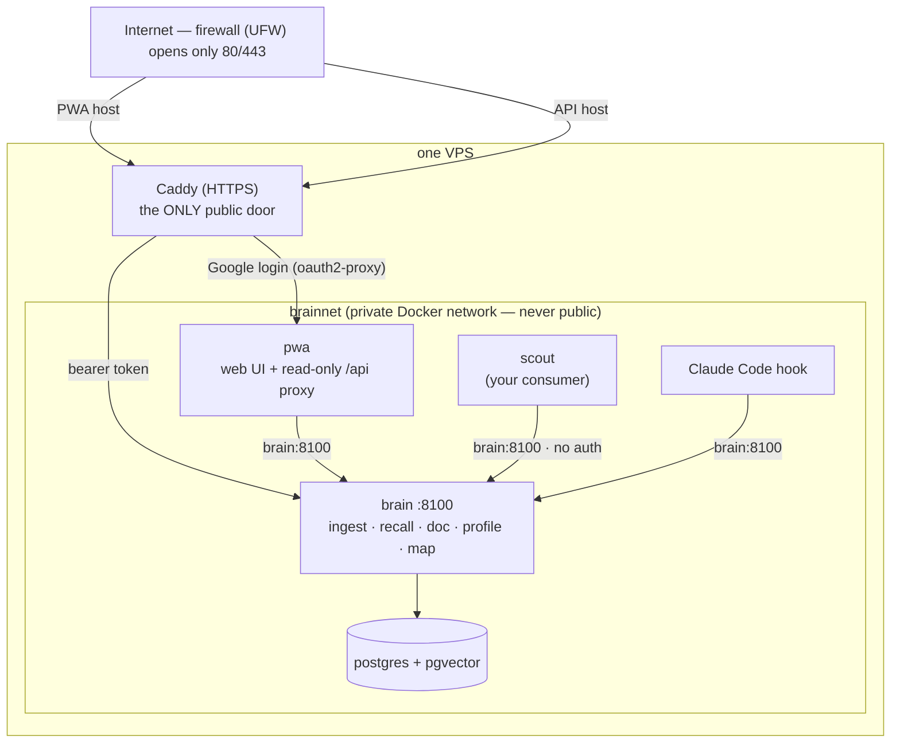

# brainbot

A self-hosted personal knowledge service. **Plug-and-play intelligence for any app you build.**

The brain is a **Postgres + pgvector document store**: your human-edited pages (Notion today) are ingested as canonical **sources**, split into embedded section **chunks**, and served back over HTTP + MCP via three consumer reads — `recall(query)` (hybrid search), `doc(id)` (deterministic whole-document fetch), and `map()` (discovery). There is no graph DB and no write-time LLM — embedding is the only external call at ingest, and editing the brain means editing the source page.

Concrete example: keep your work history + the kind of roles you'd consider in Notion, ingest those pages, and build a separate app that fetches job listings. That app calls the brain to score each listing against what it actually knows about you — without you maintaining a separate profile per app.

Two first-party consumers ship with the project, both as worked examples:

- **Claude Code MCP** — terminal harness in any project repo. A `UserPromptSubmit` hook injects relevant brain context into every prompt.
- **PWA** — a phone surface, Google-auth'd at the edge: dashboard, recall search, source map, Notion discovery + selective ingest, and in-app docs.

But these are just two of many possible consumers. The point of the project is the shared brain. Your job-fit scorer, your travel planner, your reading-list app — each one stays small and stateless because the brain holds the cross-app knowledge.

## Why this exists

1. **Human-edited truth, machine-derived index.** The sources you curate are canonical; the chunks the machine retrieves are derived and rebuilt on every edit, so the index can't go stale and there's no extraction layer to silently drop your facts. (The project started as a knowledge graph and walked it back when the evidence said otherwise — the story is in [`docs/learnings.md`](./docs/learnings.md).)
2. **One brain, many consumers.** The same knowledge backs every app you build. Each consumer stays narrow and dumb; the brain stays the only thing that has to be smart.

The architecture and decision rationale live in [`docs/architecture.md`](./docs/architecture.md); the full doc set is indexed at [`docs/README.md`](./docs/README.md).

## Status

| Milestone | Status |
|---|---|
| VPS + Docker substrate (Caddy, UFW, Tailscale) | ✅ done |
| Document substrate: sources + chunks on pgvector, `recall`/`doc`/`profile`/`map` | ✅ live |
| Section-level chunking + complete-mode recall | ✅ live |
| PWA: dashboard, search, map, Notion discovery + selective ingest, in-app docs | ✅ live (free-text capture disabled pending a source-editing surface) |
| VPS deployment of the substrate stack | 🟡 pending |

Pending feature plans live in [`plans/`](./plans/).

## Repo layout

```
brainbot/
├── docs/                        — all project docs (index: docs/README.md)
├── plans/                       — open feature plans
├── brain/                       — the brain service (FastMCP + asyncpg; ingest + reads + MCP face)
├── pwa/                         — the phone surface (vanilla TS + Vite; read-only proxy backend)
├── compose/                     — docker-compose, Caddyfile, oauth2-proxy whitelist
├── scripts/
│   └── smoke_substrate.py       — live end-to-end smoke (ingest → recall/profile/map)
└── templates/
    └── claude-code-client/      — drop-in MCP config + UserPromptSubmit hook for any project repo
```

## How access works (security model)



**In plain words:**

- **From the internet there is exactly one door: Caddy (port 443).** The firewall (UFW) blocks everything else. Caddy is locked two ways:
  - `brain.{domain}` (the PWA) → **Google login** (oauth2-proxy + email whitelist).
  - `brain.api.{domain}` (the brain API) → **bearer token**.
- **Inside the VPS, the services share a private Docker network, `brainnet`** — created by docker-compose and never exposed publicly. Anything on it (Scout, the PWA, the Claude Code hook) calls **`http://brain:8100` directly, with no auth**, because the brain's port is never published to the internet.

**Rule of thumb:**

- **Off the VPS** (your laptop, another server): `https://brain.api.{domain}` + the bearer token.
- **On the VPS, on `brainnet`** (e.g. Scout): `http://brain:8100` — no token needed.
- Only put services you trust on `brainnet`. Being on it = being allowed to call the brain (there's no per-app auth inside).

## Running it (fresh install)

The stack is two compose services: `postgres` (pgvector) and `brain` (FastMCP + asyncpg). On the VPS a third, `pwa`, serves the phone surface, and Caddy adds two vhosts — `brain.api.{domain}` (bearer-authed API) and `brain.{domain}` (Google sign-in via oauth2-proxy).

### 1. Configure env

```sh
cd compose
cp .env.example .env
# edit .env: set VOYAGE_API_KEY (embeddings), NOTION_TOKEN (page fetch on
# ingest), and POSTGRES_PASSWORD. For the VPS also set BRAIN_DOMAIN,
# BRAIN_BEARER_TOKEN, and the Google OAuth client vars +
# OAUTH2_PROXY_COOKIE_SECRET (PWA auth).
#
# Voyage: you'll need a payment method on https://dashboard.voyageai.com/
# even though usage fits inside the free allowance — without a card, the
# 3 RPM free-tier rate limit chokes ingest. See Known limits below.
```

### 2. Bring the stack up

**Local laptop (no Caddy, no TLS; brain + postgres exposed on 127.0.0.1; no pwa container — run the dashboard host-native):**
```sh
docker compose -f docker-compose.yml -f docker-compose.local.yml up -d
docker compose ps                       # both healthy?
```

The `brain` service is at `http://127.0.0.1:8100`; Postgres is inspectable at `127.0.0.1:5432`. For the PWA locally, `cd pwa && npm run dev` (see [`docs/pwa.md`](./docs/pwa.md)). Do **not** layer the local overlay on the VPS.

**VPS (with the Caddy vhosts from `compose/Caddyfile` already serving `brain.api.{your-domain}` + `brain.{your-domain}`):**
```sh
docker compose up -d
docker compose ps
```

### 3. Smoke test

The live end-to-end smoke ingests a Notion page, then exercises `recall` / `profile` / `map` and asserts the page's chunk comes back:

```sh
BRAIN_URL=http://127.0.0.1:8100 python scripts/smoke_substrate.py
```

It needs `NOTION_TOKEN` (the page must be shared with that integration) and the brain running with `VOYAGE_API_KEY` + `PG_DSN`. See the script header for the full env list and how to override the page.

### 4. Drop content in

The input is a Notion page. The brain fetches it, splits it into section chunks (one per heading; an unheadinged page stays one chunk), embeds them, and serves them back via `recall`:

```sh
curl -X POST http://127.0.0.1:8100/ingest \
  -H 'Content-Type: application/json' \
  -d '{"url": "https://www.notion.so/Some-Page-<id>"}'
```

Re-ingesting the same page wipes-and-replaces its chunks, so the page stays the source of truth. The PWA's discover view does the same thing from a phone, with selective ingest.

### 5. Wire Claude Code (optional)

See [`templates/claude-code-client/INSTALL.md`](templates/claude-code-client/INSTALL.md) for how to drop the MCP server entry and the `UserPromptSubmit` memory injection hook into any of your project repos. This is the canonical example of "a consumer app talking to the brain over HTTP/MCP."

### 6. Building your own consumer

The brain exposes a small contract — `recall`, `doc`, `map` — over **plain HTTP/JSON** (`GET /recall`, `GET /doc`, `GET /map`). Any app — Python, TypeScript, a shell script — can hit it. **If your consumer runs on the same VPS** (e.g. Scout), call `http://brain:8100` directly over `brainnet` — no auth needed; **from off-box**, use `https://brain.api.{domain}` + the bearer token. (See [How access works](#how-access-works-security-model).) The same reads are also exposed as **MCP tools** at `/mcp` for Claude Code and other LLM-tool-discovery harnesses. See [`docs/consumer-integration.md`](./docs/consumer-integration.md); full contract in [`docs/consumer-api.md`](./docs/consumer-api.md).

The brain doesn't enforce any schema on you — your job-fit scorer and your reading-list app both ask questions in plain language and reason over the same faithful chunks. That's the whole point.

## Known limits + setup gotchas

### `.env` location + shell env shadow (both structurally addressed)

Two related Compose footguns we hit:
- Compose only auto-loads `.env` from the **same directory as the compose file** (`compose/.env`, not the repo root `.env.local`).
- Compose's `${VAR}` interpolation reads the shell environment *before* `.env`, and treats an empty shell value as authoritative — so a shell's empty `ANTHROPIC_API_KEY=""` export (Claude Code subshells do this) can shadow a real key in `.env`.

Both are sidestepped by using `env_file: .env` (which loads `.env` directly into the container env, bypassing shell interpolation entirely) — which is what our compose does. **One caveat:** `docker compose restart` does *not* reload `env_file`. Only `down && up` does. If you edit `.env`, full-recreate.

### Voyage requires a payment method on file

Voyage's free tier gives you 200M tokens/month free — but without a payment method on file, you're rate-limited to **3 RPM / 10K TPM**, which chokes ingest (each ingest embeds every section of the page in a batched call, and a multi-page sync blows past 3 RPM). **Add a card on the [Voyage dashboard](https://dashboard.voyageai.com/)** — the free tokens stay free; the card just lifts the throttle. Real cost at personal-brain scale is cents.

If you prefer not to use Voyage, swap the embedder: `BRAIN_EMBED_MODEL` + the matching `EMBED_DIM` (see [`docs/embedder.md`](./docs/embedder.md)).

### Other things that bit us once

- The MCP streamable-HTTP endpoint is `/mcp` (no trailing slash). Clients must initialize a session via an `initialize` JSON-RPC call before any tool call — the returned `mcp-session-id` header has to be echoed on every subsequent request.
- `scripts/smoke_substrate.py` needs `requests` (not pinned in a `requirements.txt`).
- The first `docker compose up` triggers a multi-minute image build (`uv sync` downloads the Python dep tree). Subsequent ups reuse the cached layer.
