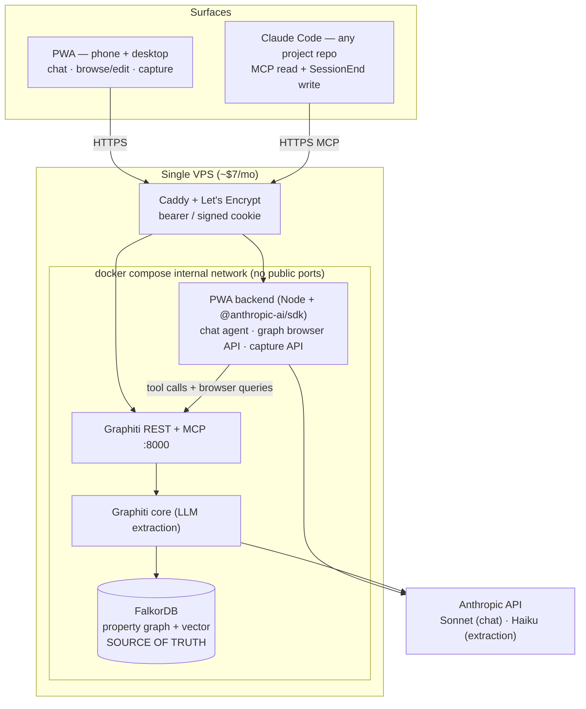

# Brainbot — Architecture & Phased Build Plan

A self-hosted personal knowledge service. The brain is the only thing that holds structured truth about you; everything else — terminal harnesses, mobile apps, narrow scoring agents — is a thin consumer that calls in. One graph, N consumers.

**Dual purpose:** this is a daily-driver tool *and* a portfolio piece. Every architectural decision should be defensible to a senior-eng interviewer. The writeup is half the deliverable. Per-component working docs (current state, tradeoffs, alternatives considered) live in [`docs/`](./docs/README.md).

## Goal

One self-hosted brain (Graphiti on FalkorDB) reached over HTTP + MCP by any number of small consumer apps. Each consumer stays stateless and narrow because the cross-app knowledge lives in the brain.

The brain itself is graph-shaped end to end. There is no markdown substrate, no file watcher, no derived projection of the data — Graphiti is the source of truth. Consumers read what the brain knows; consumers don't keep their own parallel state.

### First-party consumers shipped with the project

These are example consumers built as part of the project to prove the contract. They are not the point of the project — the brain is.

- **Claude Code MCP** (Phase 1) — terminal harness in any project repo. `UserPromptSubmit` hook injects relevant brain context into every prompt; `SessionEnd` writes a session summary back as an episode.
- **PWA** (Phase 2, planned, scope may shrink) — phone + desktop surface for direct human use: chat, browse/edit, capture.

### Third-party consumers (the actual vision)

Apps you build later, each calling the brain over HTTP/MCP. Examples worth building once the substrate is solid:

- Job-fit scorer that consults work history + role preferences in the brain
- Reading-queue triage that knows what you've already absorbed
- Calendar prep that pulls everything you've ever captured about attendees
- Passive CRM that builds itself from "had coffee with X" captures

The brain doesn't care which consumer is asking. There's no schema migration, no per-app namespace, no profile config — just `search_nodes(query)` and `search_memory_facts(query)` over the same `brain` group.

## Non-goals

- Multi-user / sharing / collab — single-user system
- Realtime collaboration features
- A general-purpose Notion competitor
- Feature breadth for its own sake — portfolio value comes from *daily use*, not surface area
- A markdown-canonical brain (considered, parked — see [docs/human-edit-surface.md](./docs/human-edit-surface.md))

## Why not just use Hermes (or similar)?

[Hermes Agent](https://github.com/nousresearch/hermes-agent) ships ~70% of what's planned here in an afternoon: self-hosted, multi-surface, scheduled automations. Worth naming explicitly because the question will come up in interviews.

The reason to build instead of adopt comes down to **memory shape**:

| Hermes (turn-shaped) | Brainbot (episode-shaped graph) |
|---|---|
| Memory triggered per chat turn — `prefetch` before, `sync_turn` after | Anything can be an episode — a captured thought, a journal entry, a session summary, a status change |
| Strings + embeddings, semantic recall | Typed entities + relations, structured queries |
| One canonical entity only if vector search lands; otherwise fragments silently | Explicit entity dedup; one node per thing, all relations attached |
| No bi-temporal — old facts rot in place | `valid_from` / `valid_to` on every fact; corrections invalidate cleanly |
| Degrades gracefully under bad data (fuzzy match still finds things) | Fails brittle if extraction drifts (wrong edge name = empty result) |

Bet being made: **structured queries over your own life are worth the cost of running an LLM-extraction layer on every write.** "What people have I talked to about X in the last 30 days, and what did each of them say?" should be a graph query, not a vector search across chat turns.

The risk is real and acknowledged in the [extraction-quality](#extraction-quality-the-real-risk) section below.

## Why this shape (the key decisions)

| Decision | Why |
|---|---|
| **Graphiti (Apache 2.0) for the graph engine** | Bi-temporal property graph, schema-flexible (string-typed nodes/edges, no migrations), official MCP server already shipped. Graphiti makes ingestion via LLM extraction. |
| **FalkorDB as Graphiti backend** | Redis-module, ~6× more memory-efficient than Neo4j. Fits comfortably on a small VPS. |
| **Custom PWA with `@anthropic-ai/sdk` harness** | The unlock. Mobile-first surface that owns the chat agent, the graph browser/editor, and the capture screen — three modes against one brain. |
| **Graph-canonical, no markdown substrate** | The PWA exposes the graph directly. No file system, no watcher, no parser between editor and graph. Edits hit Graphiti as mutations. The file-canonical alternative was considered seriously and parked — see [docs/human-edit-surface.md](./docs/human-edit-surface.md). |
| **MCP for Claude Code only** | The terminal harness gets a Graphiti MCP server pointer added to its config and a `UserPromptSubmit` hook that injects relevant memory. The PWA bypasses MCP because it talks to Graphiti directly on the docker network. |
| **No second store** | The brain (FalkorDB via Graphiti) is the only persistent store in early phases. No Postgres, no SQLite. Tool-call logs go to stderr; the PWA writes to Graphiti synchronously. If observability or queueing later genuinely demand a second store, it gets added then — not preemptively. |

## Surfaces

The PWA has three modes, each a peer of the others. None is built around a specific workflow — workflows are things the agent composes from generic tools, not bespoke features.

| Mode | What it's for | Primary use |
|---|---|---|
| **Chat** | Conversational interaction with an agent that has tools over the brain | "What do you know about X?", "Help me think through Y", "Draft something using my notes on Z" |
| **Browse / Edit** | Direct view of graph data — episodes, entities, relations. Inline edit on text fields, rename entities, delete edges. | "Find that thought I captured last Tuesday", "Fix the spelling on this entity name", "This edge is wrong, remove it" |
| **Capture** | Single-purpose append: textarea, send, optimistic acknowledge in <100ms. | "Save this thought before it leaves my head" — from anywhere on the phone |

Claude Code in a project repo gets a fourth role: ambient memory. Its `UserPromptSubmit` hook queries the graph and prepends relevant context to every prompt; its `SessionEnd` hook writes a session summary back as an episode.

## Architecture



### Data flow — capture, browse, edit, recall (the smoke test)

```
1. Phone, on the train: open PWA → Capture screen → type a thought → tap send.
   POST /api/capture → graphiti add_episode (synchronous, ~1–3s for extraction).
   UI shows a "captured" toast when Graphiti returns.

2. Laptop, later: open PWA → Browse → search/list → click into the new entity.
   GET /api/graph/entity/<id> → reads FalkorDB via Graphiti.
   Inline-edit a field → PATCH /api/graph/entity/<id> → mutation hits Graphiti.

3. Same session: switch to Chat → "what was the latest thing I captured about X?".
   Agent calls search_brain tool → graphiti hybrid search → returns the episode
   + edited entity. Agent answers with the corrected content.
```

The synchronous capture path is intentional for early phases. An async queue gets introduced later (Phase 3) if and when the iOS Shortcut path needs <100ms response — not before.

The whole loop exercises every surface against one source of truth.

### Data flow — Claude Code in a project repo

```
1. Open a session in any repo where the brain hooks are installed.
   UserPromptSubmit fires on every prompt → queries Graphiti search_nodes
   → prepends a <relevant-memory> block. The user never types "search the brain";
   it's ambient.

2. Use the session normally. SessionEnd fires when the session closes →
   summarizes the transcript with Haiku → POSTs an episode to Graphiti.

3. Tomorrow, in any repo: ask "what did I work on yesterday?" →
   the inject hook surfaces yesterday's session summary.
```

## Stack

| Component | Choice | Notes |
|---|---|---|
| **Graph engine** | Graphiti (Apache 2.0) | https://github.com/getzep/graphiti |
| **Graph DB** | FalkorDB | Redis-module; default backend for Graphiti's MCP server |
| **MCP server** | Graphiti's official MCP | Dockerized, semver'd, multi-arch |
| **PWA frontend** | SvelteKit (default) or Next.js | SvelteKit for lighter footprint and faster dev |
| **PWA backend** | TypeScript (SvelteKit server routes or Hono) | One process: chat harness + graph browser API + capture API |
| **Agent SDK** | `@anthropic-ai/sdk` | Tool use API for the chat harness |
| **Auth** | Bearer token at Caddy for the brain API; Google sign-in + email whitelist (oauth2-proxy at the edge) for the PWA | Per-identity access + easy revocation on phones; internal services (brain, FalkorDB) never publish ports. See [plans/phase-2-pwa-auth.md](plans/phase-2-pwa-auth.md). |
| **Deployment** | Single docker-compose on a small VPS | All services on one box. Iteration: `git pull && docker compose up -d --build`. |
| **Ingestion model** | Claude Haiku (provider-neutral via OpenAI-compatible API; OpenRouter by default) | Cheap; runs on every episode write. Swap provider via env. |
| **Chat model** | Claude Sonnet (latest) | The user-facing harness |
| **TLS / domain** | Caddy + Let's Encrypt | UFW restricts to 80/443; fail2ban handles abuse |

## Phased plan

Each phase is broken into bite-size tasks in [`plans/`](./plans/). The list here is the executive summary.

### Phase 0 — VPS substrate
- Small VPS (~8GB RAM is comfortable), Ubuntu LTS
- Tailscale for ops access, UFW + fail2ban
- Docker + docker-compose pattern, non-root user

### Phase 1 — Brain online, agent reads it
**Outcome:** Claude Code in any configured project repo can query the graph and gets relevant memories injected automatically. Initial seed content migrated in.

**On migrators:** the brain is meant to swallow messy personal data from wherever you've been hoarding it. Notion is the first source we ship a migrator for, but it's one of many — Obsidian/markdown vaults, Roam/Logseq, Apple Notes, plain-text journals, and anything else with an export are all plausible siblings. The migrator's contract is generic (produce `{ name, body, reference_time }` payloads; hand to a shared dispatcher; Graphiti's per-write extraction handles routing and dedup), so adding a new source is sibling-file work, not a refactor. Pluggability stays implicit until a second migrator forces a shared layer — premature `migrate/lib/` extraction is exactly the kind of overdesign this project avoids.

Detail: [`plans/phase-1-graph-online.md`](./plans/phase-1-graph-online.md)

**Definition of done:** the agent surfaces relevant context from the graph without being told where to look.

### Phase 2 — PWA: chat + browse/edit + capture
**Outcome:** Phone/desktop home-screen app with three modes (chat, browse/edit, capture), all reading and writing to the same brain Claude Code uses on the laptop.

Detail: [`plans/phase-2-pwa-harness.md`](./plans/phase-2-pwa-harness.md)

**Definition of done — the smoke test:** capture a thought on phone → find it in the entity browser on laptop → edit it inline → ask the chat agent about it next turn → the answer reflects the edit. End to end in one session.

### Phase 3 — Write-back loop + capture surface polish
**Outcome:** Sessions feed the brain. Capturing a thought is a 2-second action from anywhere (PWA capture screen, iOS Shortcut → capture endpoint, Claude Code session summaries).

Detail: [`plans/phase-3-writeback.md`](./plans/phase-3-writeback.md)

**Definition of done:** continuity across sessions and surfaces is real, not aspirational.

### Phase 4 — Hardening + life expansion
Detail: [`plans/phase-4-hardening.md`](./plans/phase-4-hardening.md)

## Extraction quality (the real risk)

Cost isn't the constraint — extraction quality is. Every episode write asks the extraction model "what entities are in this text?" When it's wrong, the graph silently fragments:

- "Coffee with Sarah from Acme" creates a *new* `Acme` node instead of linking to the existing one because context was thin
- "Outreach to a founder" one week, "DM'd a CEO" the next — does the extractor link them as the same edge type?
- Over-specifying edge types up front (`outreach_to` vs `messaged` vs `dm_sent`) means surgical queries miss 2/3 of the data

Three hedges, all lightweight:

1. **Hybrid retrieval from day one.** Every query does vector search *and* graph lookup, returns the union. Graceful degradation when the graph is fragmented.
2. **Direct edit surface.** When extraction gets something wrong, the human can fix it in the browse/edit UI without writing a corrective episode. This is the strongest hedge — and the reason graph-canonical is viable at all.
3. **Weekly dedup audit** (Phase 4). Script surfaces near-duplicate entities for merge. Catches drift before it compounds.

If these hedges fail and the graph noticeably degrades, the fallback is honest: pull a Hermes-style turn-shaped provider in as a second memory layer alongside the graph. Not a defeat — just an admission that some recall is better as semantic search.

## Open questions

1. **Ingestion model cost ceiling.** Graphiti calls an LLM at every episode write to extract entities. At expected volume with Haiku, probably <$5/mo. Confirm by counting expected episodes per week × tokens-per-episode.
2. **PWA framework: Svelte vs Next.** Pick before Phase 2 starts. Defaulting to SvelteKit.
3. **Mutation API granularity.** What's the minimum set of graph mutations the browse/edit UI needs to expose? At least: `update_episode_body`, `rename_entity`, `set_entity_attribute`, `delete_edge`, `merge_entities`. Settled in Phase 2 design.
4. **~~Cookie-based auth on the PWA.~~** Resolved: Google sign-in + email whitelist enforced at the edge by oauth2-proxy (session cookie, no bearer on the phone). See [plans/phase-2-pwa-auth.md](plans/phase-2-pwa-auth.md).

## Honest tradeoffs (signed off)

- **You own the harness.** No "Claude Code update will fix that" — when the PWA agent has a bad day, you debug the harness.
- **The PWA is yours forever.** Polish, mobile UX, edge cases — all your problem. Counterpoint: it's also what makes the experience yours.
- **You own the graph editor.** Graph-canonical means there's no Obsidian to fall back on. The browse/edit UI is real product surface area to maintain.
- **Schema flex is real but not free.** Graphiti's edge/node typing is string-based; nothing stops you from creating `outreach_to` and `outreached_to` as different edge types and getting confused. Discipline matters; convention beats configuration.
- **Episode writes can't block the UI.** 1–3s LLM extraction means every write surface needs optimistic UX with background error toasts. Designed for, not papered over.

## Portfolio artifacts (build in public)

The project is a daily-driver tool *and* an interview asset. Each phase produces something a hiring manager can see in 90 seconds without running code.

| Phase | Public artifact |
|---|---|
| 1 | Twitter thread + blog post: "Why I built my second brain on a property graph instead of a vector store." Hermes-vs-graph table + the Graphiti/FalkorDB rationale. |
| 2 | Landing page with 30-second screen recording of the smoke test: capture on phone → browse on laptop → edit → chat-agent recall. Plus a screenshot of the graph browser. |
| 3 | Twitter thread: "Three capture surfaces, one brain — a postmortem on quick-capture UX." Honest writeup of what worked, what didn't, what's still rough. |
| 4 | Long-form writeup at a public route: the full decision history (sourced from the per-component docs in [`docs/`](./docs/README.md)), what surprised, what to do differently. Becomes the link in every job application. |

**Discipline:** ship the artifact for each phase *before* starting the next phase. The writeup is half the deliverable.

## References
- [Graphiti repo](https://github.com/getzep/graphiti)
- [Graphiti MCP server](https://github.com/getzep/graphiti/tree/main/mcp_server)
- [FalkorDB integration writeup](https://docs.falkordb.com/agentic-memory/graphiti-mcp-server.html)
- [Anthropic SDK (TS)](https://github.com/anthropics/anthropic-sdk-typescript)
- [Hermes Agent (the alternative)](https://github.com/nousresearch/hermes-agent)
