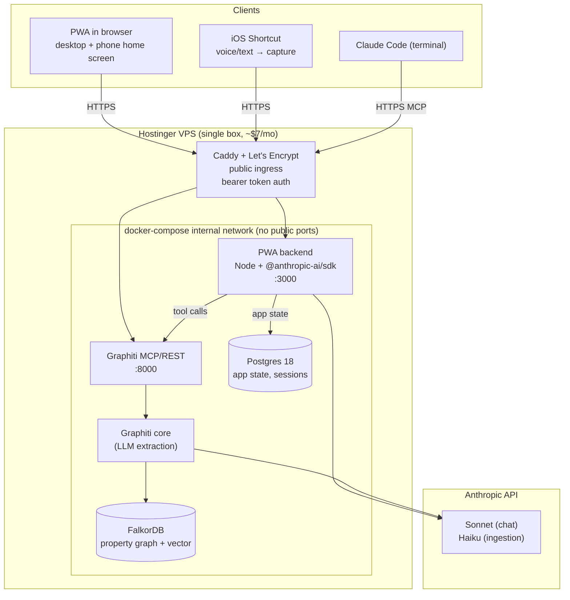
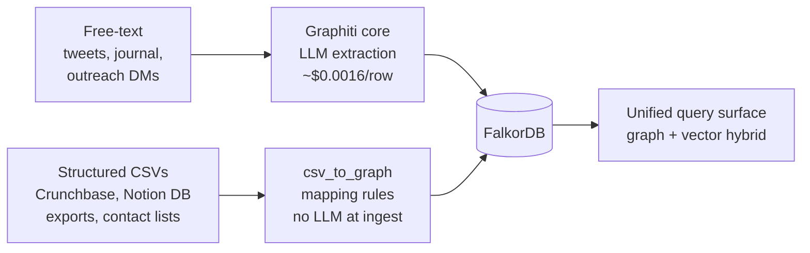

# Brainbot — Architecture & Phased Build Plan

A self-hosted knowledge graph + custom agent harness that becomes a shared brain across surfaces. Writes and reads from one source of truth. Replaces Notion as the authoritative store once Phase 2 ships.

**Dual purpose:** this is a daily-driver tool *and* a portfolio piece. Every architectural decision should be defensible to a senior-eng interviewer. The writeup is half the deliverable.

## Goal

One graph, two surfaces. PWA on phone + desktop is the daily driver for using the brain. Claude Code in the terminal is the dev/build harness for working on the system itself. Both read and write to the same Graphiti store. No dual-truth, no sync layer, no second store.

OpenClaw is being decommissioned: okay at everything, good at nothing. The PWA + iOS Shortcuts subsumes its capture use case with better integration and code owned end-to-end.

## Non-goals

- Replacing Claude Code for coding work (it's the right tool there)
- Multi-user / sharing / collab — single-user system
- Realtime collaboration features
- A general-purpose Notion competitor
- Feature breadth for its own sake — portfolio value comes from *daily use*, not surface area

## Why not just use Hermes (or similar)?

[Hermes Agent](https://github.com/nousresearch/hermes-agent) ships ~70% of what's planned here in an afternoon: self-hosted, multi-surface, scheduled automations, even a one-command OpenClaw migration. Worth naming explicitly because the question will come up in interviews.

The reason to build instead of adopt comes down to **memory shape**:

| Hermes (turn-shaped) | This project (episode-shaped graph) |
|---|---|
| Memory triggered per chat turn — `prefetch` before, `sync_turn` after | Anything can be an episode — tweet posted, tracker row flipped, journal entry, captured thought |
| Strings + embeddings, semantic recall | Typed entities + relations, structured queries |
| One canonical `Acme` only if vector search lands; otherwise fragments silently | Explicit entity dedup; one `Acme` node, all relations attached |
| No bi-temporal — old facts rot in place | `valid_from` / `valid_to` on every fact; corrections invalidate cleanly |
| Degrades gracefully under bad data (fuzzy match still finds things) | Fails brittle if extraction drifts (wrong edge name = empty result) |

Bet being made: **structured queries over my own life are worth the cost of running an LLM-extraction layer on every write.** "Latest status of every application I've sent to AI startups in the last 30 days" should be a graph query, not a vector search across chat turns.

The risk is real and acknowledged in the [extraction-quality](#extraction-quality-the-real-risk) section below.

## Why this shape (the key decisions)

| Decision | Why |
|---|---|
| **Graphiti (Apache 2.0) for the graph engine** | Bi-temporal property graph, schema-flexible (string-typed nodes/edges, no migrations), official MCP server already shipped. Graphiti makes ingestion via LLM extraction. |
| **FalkorDB as Graphiti backend** | Redis-module, ~6x more memory-efficient than Neo4j. Fits on the existing 8GB VPS without crowding Postgres + OpenClaw. |
| **Custom PWA with `@anthropic-ai/sdk` harness** | The unlock. Mobile-first agent surface, direct library access to the brain, custom tool surface for personal-specific actions (draft outreach, log episode, post tweet). |
| **MCP for Claude Code only** | The terminal harness stays as-is; gets a Graphiti MCP server pointer added to settings. The PWA bypasses MCP because it doesn't need it. |
| **Notion → Graphiti is a one-way migration** | After Phase 2, the graph is authoritative. Notion can stay as an archive view but writes happen in the PWA + agent. No sync. |

## Architecture



### Data flow — two ingestion paths, one graph



The mapping-file path skips extraction because structured columns already declare the entities and relations. Both paths land in the same node/edge store; queries can't tell which path wrote a node. Free-text mentions still dedupe against CSV-loaded entities via Graphiti's entity-resolution pass.

### Data flow — drafting outreach from the PWA

```
User opens PWA → "draft outreach to founder of Acme"
      │ HTTPS + bearer token
      ▼
Caddy → PWA backend (Node/TS, internal port 3000)
   ├─ search_brain("similar outreach to AI startup founders")
   │     → graphiti REST (localhost:8000) → FalkorDB → returns 3 nearest episodes
   ├─ get_company_context("Acme")
   │     → graphiti REST → returns Acme node + relations
   ├─ load_voice_rules()
   │     → graphiti REST → returns voice document nodes
   │
   ├─ Anthropic SDK call:
   │     system: "you are the user's writing partner..."
   │     context: <retrieved memories + voice + company>
   │     tools: [draft_outreach, save_draft, log_episode]
   │
   └─ Stream response back through Caddy to PWA UI
         → User edits → clicks "save"
         → save_draft tool fires → graphiti add_episode
         → graph now knows: drafted X for Acme on date Y

All cross-service calls happen over the docker-compose internal network.
No service except Caddy is reachable from outside the box.
```

### Data flow — Claude Code working in a project repo

```
User in terminal → "what tracker entries are stale?"
      │
      ▼
Claude Code harness
   └─ mcp__graphiti__search_facts({"query": "applied >14 days no response"})
         → MCP roundtrip → Graphiti → FalkorDB
         → returns matching tracker entries
   └─ Claude responds with the list
```

## Stack

| Component | Choice | Notes |
|---|---|---|
| **Graph engine** | Graphiti (Apache 2.0) | https://github.com/getzep/graphiti |
| **Graph DB** | FalkorDB | Redis-module; default backend for Graphiti's MCP server |
| **MCP server** | Graphiti's official MCP | Dockerized, semver'd, multi-arch |
| **PWA frontend** | SvelteKit *or* Next.js | SvelteKit default for lighter footprint and faster dev |
| **PWA backend** | TypeScript (Hono or Next.js API routes) | One process, holds the SDK harness + tool implementations. Calls Graphiti over Docker internal network. |
| **Agent SDK** | `@anthropic-ai/sdk` | Tool use API for the harness |
| **DB for app state** | Existing Postgres 18 (`personal` DB, new `brain` schema) | Sessions, draft history, tool-call logs. Brain itself lives in FalkorDB. |
| **Auth** | Bearer token at Caddy (long random, rotated periodically) | Same security model as Notion — auth on a public endpoint, no VPN required. Internal services (Graphiti, FalkorDB, Postgres) never publish ports — only Caddy is public. |
| **Deployment** | Single docker-compose on Hostinger | All services on one box. Iteration: `git pull && docker compose up -d --build`. |
| **Ingestion model** | Claude Haiku (or `gpt-5-mini` later) | Cheap; runs on every episode write |
| **Chat model** | Claude Sonnet 4.6 | The user-facing harness |
| **TLS / domain** | Caddy + Let's Encrypt on public domain | e.g. `brain.{your-domain}`. UFW restricts to 80/443; fail2ban handles abuse |

## Phased plan

Each phase is broken into bite-size tasks in [`plans/`](./plans/). The list here is the executive summary.

### Phase 0 — already done ✅
- VPS provisioned (Hostinger KVM 2, 8GB RAM)
- Ubuntu 24.04 LTS, Tailscale, UFW, fail2ban
- Docker Compose pattern, non-root user
- Postgres 18 with `personal` database + schemas
- ~~OpenClaw bootstrapped~~ — decommissioning in Phase 3 (subsumed by PWA + iOS Shortcuts)

### Phase 1 — Brain online, agent reads it
**Outcome:** Claude Code in any personal repo can query the graph and gets relevant memories injected automatically.

Detail: [`plans/phase-1-graph-online.md`](./plans/phase-1-graph-online.md)

**Definition of done:** the agent surfaces relevant context from the graph without being told where to look.

### Phase 1b — CSV bulk loader (structured data path)
**Outcome:** Tabular datasets (Crunchbase exports, contact lists, Notion DB exports) load directly into FalkorDB via a declarative mapping file, bypassing LLM extraction entirely. ~2 min and <$0.50 for a 10k-row load vs. hours and ~$80 going through Graphiti.

Detail: [`plans/phase-1b-csv-loader.md`](./plans/phase-1b-csv-loader.md)

**Definition of done:** a CSV-loaded `Company` node is queryable from Claude Code via the same MCP tools as Graphiti-extracted nodes, and entity dedup links a free-text mention of that company to the existing CSV-loaded node.

### Phase 2 — PWA + custom harness
**Outcome:** Phone/desktop chat surface that drafts outreach and tweets in voice using the brain.

Detail: [`plans/phase-2-pwa-harness.md`](./plans/phase-2-pwa-harness.md)

**Definition of done:** Drafts an outreach DM from phone, on the train, using the same brain Claude Code uses on the laptop. Everything served from one VPS, one docker-compose, one domain. `/admin` shows last week's activity at a glance.

### Phase 3 — Write-back loop + capture surface polish
**Outcome:** Sessions feed the brain. Capturing a thought is a 2-second action from anywhere.

Detail: [`plans/phase-3-writeback.md`](./plans/phase-3-writeback.md)

**Definition of done:** continuity across sessions and surfaces is real, not aspirational. OpenClaw is gone.

### Phase 4 — Hardening + life expansion
Detail: [`plans/phase-4-hardening.md`](./plans/phase-4-hardening.md)

## Extraction quality (the real risk)

Cost isn't the constraint — extraction quality is. Every episode write asks Haiku "what entities are in this text?" When it's wrong, the graph silently fragments:

- "Coffee with Sarah from Acme" creates a *new* `Acme` node instead of linking to the existing one because context was thin
- "Outreach to a founder" one week, "DM'd a CEO" the next — does Haiku link them as the same edge type?
- Over-specifying edge types up front (`outreach_to` vs `messaged` vs `dm_sent`) means surgical queries miss 2/3 of the data

Two hedges, both lightweight:

1. **Hybrid retrieval from day one.** Every query does vector search *and* graph lookup, returns the union. Graceful degradation when the graph is fragmented.
2. **Weekly dedup audit** (Phase 4). Script surfaces near-duplicate entities for merge. Catches drift before it compounds.

If these hedges fail and the graph noticeably degrades, the fallback is honest: pull a Hermes-style turn-shaped provider in as a second memory layer alongside the graph. Not a defeat — just an admission that some recall is better as semantic search.

## Open questions to resolve before Phase 1

1. **Ingestion model cost ceiling.** Graphiti calls an LLM at every episode write to extract entities. With Haiku and the expected data volume, probably <$5/mo. Confirm by counting expected episodes per week × tokens-per-episode.
2. **Domain for the brain endpoint.** A subdomain like `brain.{your-domain}` pointed at the Hostinger IP, with Caddy handling TLS via Let's Encrypt. Bearer token in the `Authorization` header.
3. **PWA framework: Svelte vs Next.** Pick before Phase 2 starts. Defaulting to SvelteKit.
4. **Voice consistency check.** When the harness drafts outreach, how do we verify it's not bleeding Twitter voice into job-hunt or vice versa? Probably: vector similarity between draft and `voice.md` triggers a soft warning if too high in a job-hunt context.

## Honest tradeoffs (signed off)

- **Notion stops being authoritative after Phase 2.** Migration is one-way. Commitment to writing through PWA + agent.
- **You own the harness.** No "Claude Code update will fix that" — when the PWA agent has a bad day, you debug the harness.
- **The PWA is yours forever.** Polish, mobile UX, edge cases — all your problem. Counterpoint: it's also what makes the experience yours.
- **Schema flex is real but not free.** Graphiti's edge/node typing is string-based; nothing stops you from creating `outreach_to` and `outreached_to` as different edge types and getting confused. Discipline matters; convention beats configuration.
- **Episode writes can't block the UI.** 1–3s LLM extraction means every write surface needs optimistic UX with background error toasts. Designed for, not papered over.

## Portfolio artifacts (build in public)

The project is a daily-driver tool *and* an interview asset. Each phase produces something a hiring manager can see in 90 seconds without running code.

| Phase | Public artifact |
|---|---|
| 1 | Twitter thread: "What I learned migrating from Notion to a self-hosted property graph in a weekend." Architecture diagram + the Hermes-vs-graph decision table. |
| 2 | Landing page with 30-second screen recording: drafting outreach on phone, same draft visible in Claude Code on laptop 30s later. Plus a `/admin` screenshot showing tool-call observability. |
| 3 | Twitter thread: "Decommissioning OpenClaw — what worked, what didn't, what I built instead." Honest postmortem; this is the kind of content that reads as senior. |
| 4 | Long-form writeup (`brain.{your-domain}/notes/architecture`): the full decision history, what surprised, what I'd do differently. Becomes the link in every job application. |

**Discipline:** ship the artifact for each phase *before* starting the next phase. The writeup is half the deliverable.

## References
- [Graphiti repo](https://github.com/getzep/graphiti)
- [Graphiti MCP server](https://github.com/getzep/graphiti/tree/main/mcp_server)
- [FalkorDB integration writeup](https://docs.falkordb.com/agentic-memory/graphiti-mcp-server.html)
- [Anthropic SDK (TS)](https://github.com/anthropics/anthropic-sdk-typescript)
- [Hermes Agent (the alternative)](https://github.com/nousresearch/hermes-agent)
