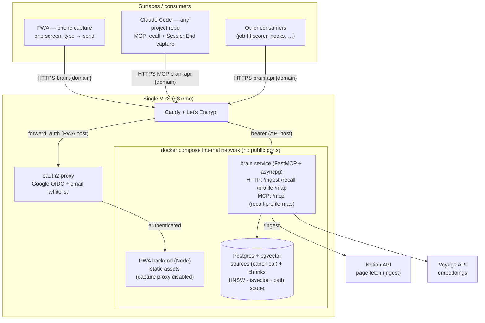

# Brainbot — Architecture & Phased Build Plan

A self-hosted personal knowledge service. The brain is the only thing that holds structured truth about you; everything else — terminal harnesses, mobile apps, narrow scoring agents — is a thin consumer that calls in. One brain, N consumers.

> **Architecture note (document-substrate cutover).** The brain is now a
> **Postgres + pgvector document store** — sources (canonical docs) split into
> embedded chunks, read via `recall` / `profile` / `map`. The earlier graph
> design (graphiti-core over FalkorDB) was dropped because `recall` never
> traversed the graph; its only real value (dedup + bi-temporal) is dissolved by
> the source-of-truth model. Rationale: [`plans/document-substrate-exploration.md`](./plans/document-substrate-exploration.md).
> Some prose below still describes the historical graph build and is being
> migrated; the Stack and key-decisions tables reflect the current substrate.

**Dual purpose:** this is a daily-driver tool *and* a portfolio piece. Every architectural decision should be defensible to a senior-eng interviewer. The writeup is half the deliverable. Per-component working docs (current state, tradeoffs, alternatives considered) live in [`docs/`](./docs/README.md).

## Goal

One self-hosted brain (Postgres + pgvector) reached over HTTP + MCP by any number of small consumer apps. Each consumer stays stateless and narrow because the cross-app knowledge lives in the brain.

The brain is a document store: **sources are canonical**, and their text is split into embedded **chunks** for retrieval. Sources are the source of truth; chunks are a derived, disposable index — re-derived (wipe-replace) whenever a source is ingested or edited, so currency is guaranteed by construction. Consumers read what the brain knows (`recall` / `profile` / `map`); they don't keep their own parallel state, and they never write back.

### First-party consumers shipped with the project

These are example consumers built as part of the project to prove the contract. They are not the point of the project — the brain is.

- **Claude Code MCP** (Phase 1) — terminal harness in any project repo. `UserPromptSubmit` hook injects relevant brain context into every prompt; `SessionEnd` writes a session summary back as an episode.
- **PWA** (Phase 2) — a one-screen phone capture surface (type a thought → send → it lands in the brain), Google-auth'd at the edge. The original chat + browse/edit modes were dropped in the pivot; graph inspection is done via the FalkorDB Browser.

### Third-party consumers (the actual vision)

Apps you build later, each calling the brain over HTTP/MCP. Examples worth building once the substrate is solid:

- Job-fit scorer that consults work history + role preferences in the brain
- Reading-queue triage that knows what you've already absorbed
- Calendar prep that pulls everything you've ever captured about attendees
- Passive CRM that builds itself from "had coffee with X" captures

The brain doesn't care which consumer is asking. There's no schema migration, no per-app namespace, no profile config — just `recall(query, scope)`, `profile(scope)`, and `map(scope)` over the same source tree (writes arrive via `ingest`).

## Non-goals

- Multi-user / sharing / collab — single-user system
- Realtime collaboration features
- A general-purpose Notion competitor
- Feature breadth for its own sake — portfolio value comes from *daily use*, not surface area
- A markdown-canonical brain (considered, parked — see [docs/human-edit-surface.md](./docs/human-edit-surface.md))

## Why not just use Hermes (or similar)?

[Hermes Agent](https://github.com/nousresearch/hermes-agent) ships ~70% of what's planned here in an afternoon: self-hosted, multi-surface, scheduled automations. Worth naming explicitly because the question will come up in interviews.

The reason to build instead of adopt comes down to **memory shape**:

| Hermes (turn-shaped) | Brainbot (episode-shaped graph) |
|---|---|
| Memory triggered per chat turn — `prefetch` before, `sync_turn` after | Anything can be an episode — a captured thought, a journal entry, a session summary, a status change |
| Strings + embeddings, semantic recall | Typed entities + relations, structured queries |
| One canonical entity only if vector search lands; otherwise fragments silently | Explicit entity dedup; one node per thing, all relations attached |
| No bi-temporal — old facts rot in place | `valid_from` / `valid_to` on every fact; corrections invalidate cleanly |
| Degrades gracefully under bad data (fuzzy match still finds things) | Fails brittle if extraction drifts (wrong edge name = empty result) |

Bet being made: **structured queries over your own life are worth the cost of running an LLM-extraction layer on every write.** "What people have I talked to about X in the last 30 days, and what did each of them say?" should be a graph query, not a vector search across chat turns.

The risk is real and acknowledged in the [extraction-quality](#extraction-quality-the-real-risk) section below.

## Why this shape (the key decisions)

| Decision | Why |
|---|---|
| **Postgres + pgvector as the substrate** | One engine for relational (`sources`/`chunks` + a materialized `path`), vectors (HNSW), and full-text (`tsvector`). A document/vector RAG store — which is what the brain's reads actually are. Replaces the earlier graphiti-on-FalkorDB design (which never traversed the graph; see [`plans/document-substrate-exploration.md`](./plans/document-substrate-exploration.md)). |
| **Sources canonical, chunks derived** | A source (doc/capture/Notion page) owns its chunks; ingest/edit does wipe-replace (`DELETE` chunks → re-embed → re-`INSERT`). Currency is guaranteed by construction — no bi-temporal invalidation, no write-time entity resolution. |
| **No write-time LLM** | Ingest is split + embed + insert. Embedding (Voyage) is the only external call and the embedder is pluggable. No extraction, no decomposition, no schema-tagging. |
| **A smart `brain` service, thin consumers** | The brain (FastMCP + asyncpg in-process) owns the substrate: ingest, hybrid recall, and profile assembly. Consumers (the PWA, Claude Code, your apps) stay dumb and read-only. |
| **Narrow contract: recall / profile / map** | The brain exposes three reads plus `ingest`, not a full DB-introspection toolset. The human edits the legible *source* (a doc/Notion page), never the machine-derived chunks — the answer to [docs/human-edit-surface.md](./docs/human-edit-surface.md). |
| **Two front doors** | Plain HTTP/JSON for typed consumers (the default); MCP at `/mcp` for Claude Code and other LLM-tool-discovery harnesses. Same three reads behind both. |
| **One store** | Postgres + pgvector is the only persistent store. Logs go to stderr. If observability or queueing later genuinely demand a second store, it gets added then — not preemptively. |

## Surfaces

The PWA was **one screen: capture.** With the document-substrate cutover the brain's write path is **ingest a source** (a Notion page / doc), not a free-text `/capture` — so the PWA's send control is disabled pending a source-editing surface (the human edits the legible *source*, per [docs/human-edit-surface.md](./docs/human-edit-surface.md)). Inspecting the brain is done with plain SQL against Postgres or the `recall`/`profile`/`map` reads; a conversational consumer, if ever worth building, is a separate app.

| Surface | What it's for | Primary use |
|---|---|---|
| **PWA** | The capture screen's send is currently disabled (the `/capture` endpoint is gone with the substrate cutover; the write path is source ingest). The in-PWA "how the brain works" docs and evolution timeline still serve. | a source-editing surface is the planned re-enable |
| **Claude Code** | Ambient memory in any project repo. `UserPromptSubmit` hook `recall`s relevant context and prepends it to every prompt. | terminal work that should remember across sessions |
| **Your consumers** | Any app calling `recall`/`profile`/`map` over HTTP (job-fit scorer, calendar prep, …). | app-specific intelligence backed by the shared brain |

## Architecture



### Data flow — ingest + recall

```
1. Ingest a source:
   POST /ingest {url} → the brain fetches the Notion page (title + blocks
   flattened to markdown + the materialized path from the parent chain),
   UPSERTs the source row, wipe-replaces its chunks, and embeds them (Voyage).
   Re-posting the same URL is idempotent and always current.

2. Later, any consumer asks a question:
   GET /recall?q=&scope=... → the brain runs hybrid search over Postgres
   (cosine via pgvector + full-text via tsvector, fused with RRF), returns the
   top-k chunks. The consumer's own LLM filters/synthesizes from there.

3. Need the whole picture for a domain, not one answer:
   GET /profile?scope=<path> → every chunk under the path prefix, assembled
   into one structured Context with provenance.

4. Don't know the scope yet:
   GET /map?scope= → the (path, title) source tree.
```

Ingest re-embeds the whole source on each call (wipe-replace); section-aware
diff-and-re-embed is a later optimization, not before it's needed.

### Data flow — Claude Code in a project repo

```
1. Open a session in any repo where the brain hooks are installed.
   UserPromptSubmit fires on every prompt → calls the brain's recall
   → prepends a <relevant-memory> block. The user never types "search the brain";
   it's ambient.

2. Use the session normally. Reads are read-only — consumers never write back to
   the brain. (Writes arrive only via source ingest. The old SessionEnd
   capture-back hook is retired with the /capture endpoint; if a session should
   be remembered, it enters as a source through the human.)
```

## Stack

| Component | Choice | Notes |
|---|---|---|
| **Store** | Postgres 16 + pgvector (`pgvector/pgvector:pg16`) | One engine: relational (`sources`/`chunks` + `path`), vectors (HNSW), full-text (`tsvector`). The only persistent store. |
| **Data model** | `sources` (canonical) + `chunks` (derived, embedded sections) | `sources.path` is the materialized ancestry (domain tree); `chunks.embedding` is `vector(512)` with a generated `fts tsvector`; `ON DELETE CASCADE` = wipe-replace for free. |
| **Brain service** | Python + asyncpg + FastMCP (`brain/`) | One asyncpg pool; serves `ingest`/`recall`/`profile`/`map` over HTTP + an MCP face at `/mcp`. Run by `uvicorn brain.api:app` on :8100. |
| **MCP** | The brain's own MCP face (`/mcp`) | Tools `recall`/`profile`/`map` for Claude Code. |
| **PWA frontend** | Vanilla TS + Vite (`pwa/`) | One screen. Send is disabled (the `/capture` write path is gone); the docs/evolution views still serve. |
| **PWA backend** | TypeScript, raw `node:http` | Static-asset server; the `/api/capture` proxy is disabled with the endpoint. No brain logic. |
| **Ingest** | Notion fetch (`brain/notion.py`) | `fetch_page(url) → {title, text, path}`: blocks flattened to markdown + the materialized `path` from the parent chain. |
| **Embedder** | Voyage (`voyage-3-lite`, `BRAIN_EMBED_MODEL`) | 512-dim vectors for hybrid recall. Pluggable; the column dim must match the model. |
| **Write-time LLM** | none | Ingest is split + embed + insert. No extraction/decomposition/schema-tagging. |
| **Auth** | Bearer token at Caddy for the brain API; Google sign-in + email whitelist (oauth2-proxy at the edge) for the PWA | Per-identity access + easy revocation on phones; internal services (brain, postgres) never publish ports. |
| **Deployment** | Single docker-compose on a small VPS | All services on one box. Iteration: `git pull && docker compose up -d --build`. |
| **TLS / domain** | Caddy + Let's Encrypt | UFW restricts to 80/443; fail2ban handles abuse |

## Phased plan

Each phase is broken into bite-size tasks in [`plans/`](./plans/). The list here is the executive summary.

### Phase 0 — VPS substrate
- Small VPS (~8GB RAM is comfortable), Ubuntu LTS
- Tailscale for ops access, UFW + fail2ban
- Docker + docker-compose pattern, non-root user

### Phase 1 — Brain online, agent reads it
**Outcome:** Claude Code in any configured project repo can query the graph and gets relevant memories injected automatically. Initial seed content migrated in.

**On migrators:** the brain is meant to swallow messy personal data from wherever you've been hoarding it. Notion is the first source we ship a migrator for, but it's one of many — Obsidian/markdown vaults, Roam/Logseq, Apple Notes, plain-text journals, and anything else with an export are all plausible siblings. The migrator's contract is generic (produce `{ name, body, reference_time }` payloads; hand to a shared dispatcher; Graphiti's per-write extraction handles routing and dedup), so adding a new source is sibling-file work, not a refactor. Pluggability stays implicit until a second migrator forces a shared layer — premature `migrate/lib/` extraction is exactly the kind of overdesign this project avoids.

Detail: [`plans/phase-1-graph-online.md`](./plans/phase-1-graph-online.md)

**Definition of done:** the agent surfaces relevant context from the graph without being told where to look.

### Phase 2 — brain service + one-screen capture PWA
**Outcome:** Re-scoped from the original three-mode (chat + browse/edit + capture) vision. The pivot made the brain the product, so Phase 2 shipped the standalone `brain` service (FastAPI, graphiti-core in-process) and a single-screen capture PWA that proxies to it, Google-auth'd at the edge. Chat and browse/edit were dropped (FalkorDB Browser covers inspection).

**Definition of done — the smoke test:** capture a thought on the phone → tap send → "captured" toast in <100ms → the episode lands in the brain (visible in the FalkorDB Browser within seconds).

### Next — document-substrate refactor (supersedes the old Phase 3–4)
**Reconsidered:** the graph isn't earning its keep — `recall()` never traverses, so its only real value was dedup + bi-temporal, not relationships. The go-forward is a document substrate: source-of-truth docs + derived section-chunks on pgvector, with the brain as a reusable intelligence library (`recall` / `profile` / `map`). The old write-back and hardening work folds into that.

Detail: [`plans/document-substrate-exploration.md`](./plans/document-substrate-exploration.md); rationale in [`LEARNINGS.md`](./LEARNINGS.md) Chapter 6.

## Extraction quality (the real risk)

Cost isn't the constraint — extraction quality is. Every episode write asks the extraction model "what entities are in this text?" When it's wrong, the graph silently fragments:

- "Coffee with Sarah from Acme" creates a *new* `Acme` node instead of linking to the existing one because context was thin
- "Outreach to a founder" one week, "DM'd a CEO" the next — does the extractor link them as the same edge type?
- Over-specifying edge types up front (`outreach_to` vs `messaged` vs `dm_sent`) means surgical queries miss 2/3 of the data

Three hedges, all lightweight:

1. **Hybrid retrieval from day one.** Every query does vector search *and* graph lookup, returns the union. Graceful degradation when the graph is fragmented.
2. **Correction path.** When extraction gets something wrong, today you re-capture a corrective fact (the bi-temporal model supersedes the old one) or fix it directly in the FalkorDB Browser. A first-class human-edit surface is a parked requirement — see [docs/human-edit-surface.md](./docs/human-edit-surface.md).
3. **Weekly dedup audit** (Phase 4). Script surfaces near-duplicate entities for merge. Catches drift before it compounds.

If these hedges fail and the graph noticeably degrades, the fallback is honest: pull a Hermes-style turn-shaped provider in as a second memory layer alongside the graph. Not a defeat — just an admission that some recall is better as semantic search.

## Open questions

1. **Ingestion model cost ceiling.** The brain calls an LLM at every episode write to extract entities (plus one decomposition call per capture). At expected volume with Haiku, probably <$5/mo. Confirm by counting expected captures per week × tokens-per-episode.
2. **~~PWA framework: Svelte vs Next.~~** Resolved: vanilla TS + Vite. A one-screen capture app + one backend route doesn't justify a meta-framework.
3. **~~Mutation API granularity.~~** Moot for now — the browse/edit UI was dropped in the pivot; the brain's contract is capture/recall/profile, and a human-edit surface is parked (see [docs/human-edit-surface.md](./docs/human-edit-surface.md)).
4. **~~Cookie-based auth on the PWA.~~** Resolved: Google sign-in + email whitelist enforced at the edge by oauth2-proxy (session cookie, no bearer on the phone).

## Honest tradeoffs (signed off)

- **You own the brain service.** No "Claude Code update will fix that" — when extraction or recall misbehaves, you debug the brain (`brain/`). That's also what makes the extraction tuning yours.
- **The capture PWA is yours forever.** Polish, mobile UX, install flow — all your problem. Counterpoint: it's also what makes the experience yours.
- **No human-edit UI yet.** Graph-canonical means there's no Obsidian to fall back on, and the browse/edit surface was dropped in the pivot — corrections go through re-capture or the FalkorDB Browser until a real edit surface is built. A real gap (parked, not solved).
- **Schema flex is real but not free.** graphiti-core's edge/node typing is string-based; nothing stops you from creating `outreach_to` and `outreached_to` as different edge types and getting confused. Discipline matters; convention beats configuration.
- **Episode writes can't block the UI.** 1–3s LLM extraction means every write surface needs optimistic UX with background error toasts. Designed for, not papered over.

## Portfolio artifacts (build in public)

The project is a daily-driver tool *and* an interview asset. Each phase produces something a hiring manager can see in 90 seconds without running code.

| Phase | Public artifact |
|---|---|
| 1 | Twitter thread + blog post: "Why I built my second brain on a property graph instead of a vector store." Hermes-vs-graph table + the Graphiti/FalkorDB rationale. |
| 2 | 10-second screen recording: phone home screen → tap icon → type a thought → send → "captured" toast. Caption: "Two seconds from thought to brain." Plus a screenshot of the extracted entities in the FalkorDB Browser. |
| 3 | Twitter thread: "Three capture surfaces, one brain — a postmortem on quick-capture UX." Honest writeup of what worked, what didn't, what's still rough. |
| 4 | Long-form writeup at a public route: the full decision history (sourced from the per-component docs in [`docs/`](./docs/README.md)), what surprised, what to do differently. Becomes the link in every job application. |

**Discipline:** ship the artifact for each phase *before* starting the next phase. The writeup is half the deliverable.

## References
- [Graphiti repo](https://github.com/getzep/graphiti)
- [Graphiti MCP server](https://github.com/getzep/graphiti/tree/main/mcp_server)
- [FalkorDB integration writeup](https://docs.falkordb.com/agentic-memory/graphiti-mcp-server.html)
- [Anthropic SDK (TS)](https://github.com/anthropics/anthropic-sdk-typescript)
- [Hermes Agent (the alternative)](https://github.com/nousresearch/hermes-agent)
