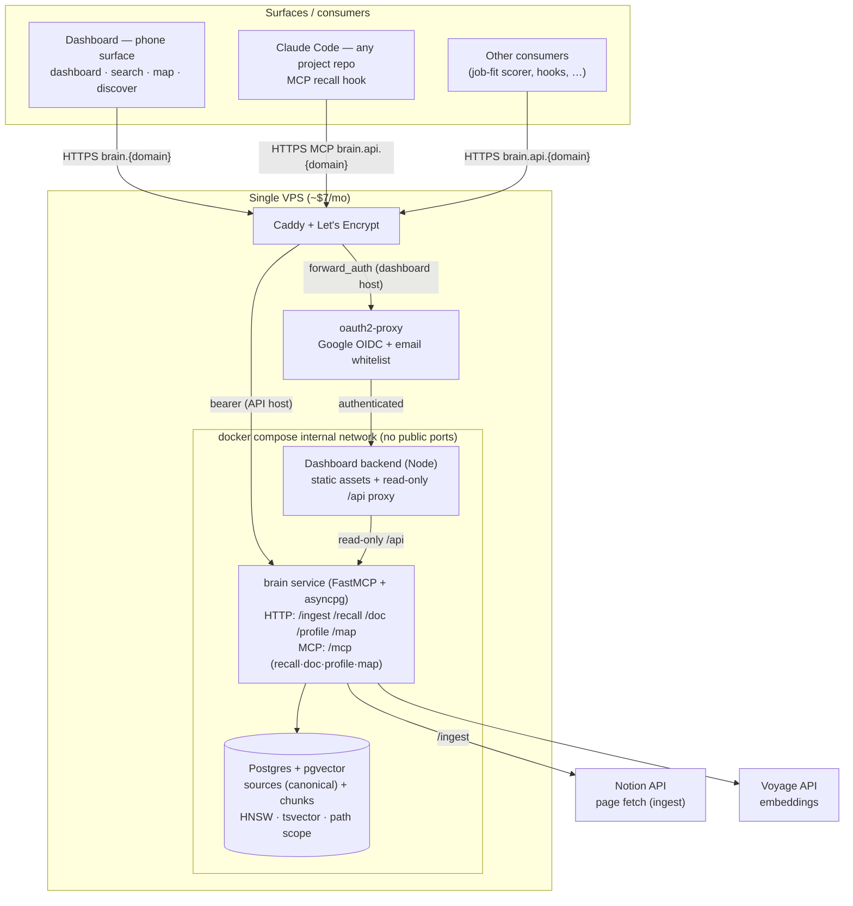

# Brainbot — Architecture

A self-hosted **control plane for personal apps**. The brain is the only thing that holds structured truth about you; everything else — terminal harnesses, mobile apps, narrow scoring agents — is a thin consumer that calls in. One brain, N consumers.

This doc covers the **brain (L1)** and the **edge (L2)** — what the brain is and how consumers read it. Once you have *more than one* app, the question becomes how to build app N+1 without inventing a stack each time; that's the four-layer platform (brain → edge → web-toolkit → apps), and it has its own companion doc: [`app-platform.md`](./app-platform.md).

**Dual purpose:** this is a daily-driver tool *and* a portfolio piece. Every architectural decision should be defensible to a senior-eng interviewer. The writeup is half the deliverable. Per-component working docs (current state, tradeoffs, alternatives considered) live in this folder — start at [`README.md`](./README.md). How the design *got* here, including the graph era and why it was dropped, is the append-only [`learnings.md`](./learnings.md).

## Goal

One self-hosted brain (Postgres + pgvector) reached over HTTP + MCP by any number of small consumer apps. Each consumer stays stateless and narrow because the cross-app knowledge lives in the brain.

The brain is a document store: **sources are canonical**, and their text is split into embedded **chunks** for retrieval. Sources are the source of truth; chunks are a derived, disposable index — re-derived (wipe-replace) whenever a source is ingested or edited, so currency is guaranteed by construction. Consumers read what the brain knows (`recall` / `doc` / `map`); they don't keep their own parallel state, and they never write back.

### First-party consumers shipped with the project

These are example consumers built as part of the project to prove the contract. They are not the point of the project — the brain is.

- **Claude Code MCP** — terminal harness in any project repo. `UserPromptSubmit` hook injects relevant brain context into every prompt.
- **Dashboard** — a one-screen phone surface, Google-auth'd at the edge: a dashboard of what the brain holds, recall search, the source map, Notion discovery + selective ingest, and the in-app "how the brain works" docs. Free-text capture is disabled pending a source-editing surface (the write path is source ingest).

### Third-party consumers (the actual vision)

Apps you build later, each calling the brain over HTTP/MCP. Examples worth building once the substrate is solid:

- Job-fit scorer that consults work history + role preferences in the brain
- Reading-queue triage that knows what you've already absorbed
- Calendar prep that pulls everything you've ever captured about attendees
- Passive CRM that builds itself from "had coffee with X" captures

The brain doesn't care which consumer is asking. There's no schema migration, no per-app namespace, no profile config — just `recall(query, scope)`, `doc(id)`, and `map(scope)` over the same source tree (writes arrive via `ingest`). A consumer that also wants a face (its own PWA + sign-in) becomes a full **platform app** — same contract, plus the web-toolkit and an edge vhost; see [`app-platform.md`](./app-platform.md).

## Non-goals

- Multi-user / sharing / collab — single-user system
- Realtime collaboration features
- A general-purpose Notion competitor
- Feature breadth for its own sake — portfolio value comes from *daily use*, not surface area

## Why not just use Hermes (or similar)?

[Hermes Agent](https://github.com/nousresearch/hermes-agent) ships a self-hosted, multi-surface personal assistant with turn-shaped memory (chat turns + vector recall) in an afternoon. Worth naming explicitly because the question will come up in interviews.

The reason to build instead of adopt is **what holds the truth**: Hermes-style memory accretes from chat turns, so the knowledge base is whatever the conversation happened to contain, fragmented across turns and never human-curated. Brainbot inverts that — **human-edited documents are canonical**, the index is derived, and the brain is a service *many* apps share rather than one assistant's memory. (The project's first answer to this question was "a knowledge graph beats turn-shaped memory"; the graph didn't survive contact with its own read path — that story is [`learnings.md`](./learnings.md).)

## Why this shape (the key decisions)

| Decision | Why |
|---|---|
| **Postgres + pgvector as the substrate** | One engine for relational (`sources`/`chunks` + a materialized `path`), vectors (HNSW), and full-text (`tsvector`). A document/vector RAG store — which is what the brain's reads actually are (chosen over a graph; [`learnings.md`](./learnings.md) Chapter 6). |
| **Sources canonical, chunks derived** | A source (doc/capture/Notion page) owns its chunks; ingest/edit does wipe-replace (`DELETE` chunks → re-embed → re-`INSERT`). Currency is guaranteed by construction — no bi-temporal invalidation, no write-time entity resolution. |
| **No write-time LLM** | Ingest is split + embed + insert. Embedding (Voyage) is the only external call and the embedder is pluggable. No extraction, no decomposition, no schema-tagging. |
| **A smart `brain` service, thin consumers** | The brain (FastMCP + asyncpg in-process) owns the substrate: ingest, hybrid recall, and profile assembly. Consumers (the dashboard, Claude Code, your apps) stay dumb and read-only. |
| **Narrow contract: recall / doc / map** | The brain exposes three consumer reads plus `ingest`, not a full DB-introspection toolset. The human edits the legible *source* (a doc/Notion page), never the machine-derived chunks. |
| **Two front doors** | Plain HTTP/JSON for typed consumers (the default); MCP at `/mcp` for Claude Code and other LLM-tool-discovery harnesses. Same reads behind both. |
| **One store** | Postgres + pgvector is the only persistent store. Logs go to stderr. If observability or queueing later genuinely demand a second store, it gets added then — not preemptively. |

## Surfaces

| Surface | What it's for | Primary use |
|---|---|---|
| **Dashboard** | Owner views: dashboard, recall search, source map, Notion discovery + selective ingest, in-app docs. Free-text capture is disabled (the write path is source ingest; a source-editing surface is the planned re-enable). | browsing and feeding the brain from a phone |
| **Claude Code** | Ambient memory in any project repo. `UserPromptSubmit` hook `recall`s relevant context and prepends it to every prompt. | terminal work that should remember across sessions |
| **Your consumers** | Any app calling `recall`/`doc`/`map` over HTTP (job-fit scorer, calendar prep, …). | app-specific intelligence backed by the shared brain |

## Architecture



### Data flow — ingest + recall

```
1. Ingest a source:
   POST /ingest {url} → the brain fetches the Notion page (title + blocks
   flattened to markdown + the materialized path from the parent chain),
   UPSERTs the source row, wipe-replaces its chunks, and embeds them (Voyage).
   Re-posting the same URL is idempotent and always current.

2. Later, any consumer asks a question:
   GET /recall?q=&scope=... → the brain runs hybrid search over Postgres
   (cosine via pgvector + full-text via tsvector, fused with RRF), returns the
   top-k chunks. The consumer's own LLM filters/synthesizes from there.

3. Need a known document whole, deterministically:
   GET /doc?id=... → the stored text verbatim + a version stamp to cache on.

4. Don't know the ids yet:
   GET /map?scope= → the source tree (ids, titles, paths, versions).
```

Ingest re-embeds the whole source on each call (wipe-replace); section-aware
diff-and-re-embed is a later optimization, not before it's needed.

### Data flow — Claude Code in a project repo

```
1. Open a session in any repo where the brain hooks are installed.
   UserPromptSubmit fires on every prompt → calls the brain's recall
   → prepends a <relevant-memory> block. The user never types "search the brain";
   it's ambient.

2. Use the session normally. Reads are read-only — consumers never write back to
   the brain. Writes arrive only via source ingest, through the human.
```

## Stack

| Component | Choice | Notes |
|---|---|---|
| **Store** | Postgres 16 + pgvector (`pgvector/pgvector:pg16`) | One engine: relational (`sources`/`chunks` + `path`), vectors (HNSW), full-text (`tsvector`). The only persistent store. |
| **Data model** | `sources` (canonical) + `chunks` (derived, embedded sections) | `sources.path` is the materialized ancestry (domain tree); `chunks.embedding` is `vector(512)` with a generated `fts tsvector`; `ON DELETE CASCADE` = wipe-replace for free. |
| **Brain service** | Python + asyncpg + FastMCP (`brain/`) | One asyncpg pool; serves `ingest`/`recall`/`doc`/`profile`/`map` over HTTP + an MCP face at `/mcp`. Run by `uvicorn brain.api:app` on :8100. |
| **MCP** | The brain's own MCP face (`/mcp`) | Tools `recall`/`doc`/`profile`/`map` for Claude Code. |
| **Dashboard frontend** | Vanilla TS + Vite (`dashboard/`) | Dashboard, search, map, discover, docs views. Capture send is disabled (the write path is source ingest). |
| **Dashboard backend** | TypeScript, raw `node:http` | Static-asset server + read-only GET proxy to the brain. No brain logic. |
| **Ingest** | Notion fetch (`brain/brain/notion.py`) | `fetch_page(url) → {title, text, path}`: blocks flattened to markdown + the materialized `path` from the parent chain. |
| **Embedder** | Voyage (`voyage-3-lite`, `BRAIN_EMBED_MODEL`) | 512-dim vectors for hybrid recall. Pluggable; the column dim must match the model. See [`embedder.md`](./embedder.md). |
| **Write-time LLM** | none | Ingest is split + embed + insert. No extraction/decomposition/schema-tagging. |
| **Auth** | Bearer token at Caddy for the brain API; Google sign-in + email whitelist (oauth2-proxy at the edge) for the dashboard | Per-identity access + easy revocation on phones; internal services (brain, postgres) never publish ports. |
| **Deployment** | Single docker-compose on a small VPS | All services on one box. Iteration: `git pull && docker compose up -d --build`. |
| **TLS / domain** | Caddy + Let's Encrypt | UFW restricts to 80/443; fail2ban handles abuse |

## History, open questions, plans

Design history — what was believed, what broke, what changed, chapter by chapter — lives in [`learnings.md`](./learnings.md). Open design questions live in [`brain-architecture.md`](./brain-architecture.md); pending feature plans in [`../plans/`](../plans/).

## Honest tradeoffs (signed off)

- **You own the brain service.** No "Claude Code update will fix that" — when ingest or recall misbehaves, you debug the brain (`brain/`). That's also what makes the retrieval pipeline yours to tune.
- **The dashboard is yours forever.** Polish, mobile UX, install flow — all your problem. Counterpoint: it's also what makes the experience yours.
- **Editing the brain means editing the source.** There's no in-app editor; you edit the Notion page and re-sync. Low-friction free-text capture is a real gap until a source-editing surface ships.
- **Notion is the only ingest path today.** The migrator contract is generic (other sources are sibling-file work), but until a second one exists, feeding the brain means going through Notion.

## References

- [pgvector](https://github.com/pgvector/pgvector)
- [Voyage AI embeddings](https://docs.voyageai.com/)
- [Hermes Agent (the turn-shaped alternative)](https://github.com/nousresearch/hermes-agent)
