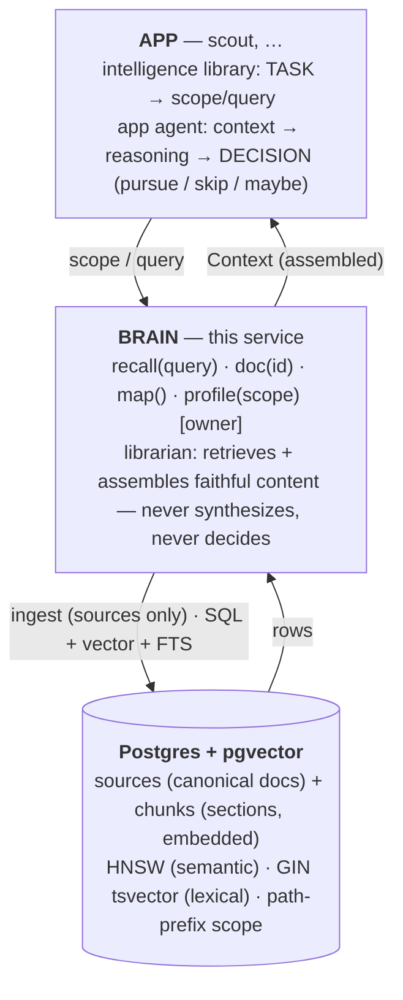

# Brain Architecture

> Living design doc. Point at this during design discussions. Implementation
> details (how to run, config, deps) live in [`brain.md`](./brain.md); this
> is the *why* and the *shape*. The full migration story (why the graph was
> dropped) lives in [`learnings.md`](./learnings.md) Chapter 6.

## What the brain is

A **central knowledge hub for a suite of personal apps** — a domain-agnostic
intelligence-gathering library about **one user**. It knows things about the
user; it does not know what any app *does* with that knowledge.

Concretely, it is a **Postgres + pgvector document store**. Sources (docs,
captures, Notion pages) are canonical; their text is split into section-chunks,
embedded with Voyage, and stored. Reads are pure retrieval over those chunks.
There is **no graph DB, no extraction/dedup/bi-temporal machinery**, and **no
write-time LLM by default** (an opt-in note-legibility layer adds one at the edge
of ingest — see principle #3 and [`note-legibility.md`](./note-legibility.md)).

Job-fit ("scout") is the first consumer. Others will follow (reading triage,
calendar prep, etc.). The brain must never learn what a "job" is — that's what
lets it serve all of them.

## The three-layer model



**Division of responsibility:**
- **App's intelligence library** — turns a *task* into the *scope or query* it
  needs, and owns reasoning over the returned `Context`.
- **Brain** — retrieves the *content relevant to a query* and *assembles* it. It
  is a **librarian**: no synthesis, no inference, no decisions. Assembly (gather
  + arrange the human's structure) is librarian work; interpretation is not.
- **App agent** — synthesizes the returned context into a *decision*.

Line in one sentence: **the brain hands back what it knows; the app reasons and
decides.**

## Interfaces

Reads are **read-only** (writes come only from sources). **The consumer
surface is `recall` + `doc` + `map`**: recall for search, map for discovering
the stable document ids (titles/paths are display-only), doc for fetching a
pinned document whole, byte-exact, with a content `version` stamp to cache on.
`profile` stays internal (brain machinery) + owner-only — it *assembles* a
domain, and an assembled view is exactly what consumers don't get (they get
faithful content and do their own reasoning). What's walled off is *synthesis*
(`profile`) — not *discovery*.

| Operation | Status | Shape | Notes |
|---|---|---|---|
| `recall(query, scope=None)` | built | query → top-k `Chunk`s | Hybrid: cosine (pgvector `<=>`) + full-text (`tsvector`), fused with RRF (`c=60`). **Consumer** — dumb apps ask a question; no scope knowledge needed. Completeness via `complete=true` (the brain's own cutoff). Each `Chunk` carries its document's stable `id`. |
| `doc(id)` | built | stable id → `{id, title, path, version, text}` | **Consumer** — one whole document, deterministically: `text` is the stored doc VERBATIM (byte-exact), `version` is a content hash over the served `{title, text}` (the cache key; path changes don't move it). 404 on unknown id; no knobs. |
| `profile(scope, budget)` | built | scope → one assembled `Context` | Every chunk under the `path` prefix, rebuilt into structured markdown. **Not a consumer endpoint** — brain-side self-enrichment (assemble a domain → distill a digest `recall` surfaces) + owner browse. Degrades past `budget`, flagging `truncated`. |
| `map(scope=None)` | built | scope → `{id, title, path, parent_id, version}` tree | **Consumer (discovery)** — where a consumer finds the ids to pin and the versions to diff; also brain-side sync reconciliation + owner navigation. `parent_id` resolves only within the synced set (else null). |
| `ingest(url)` | built | Notion URL → source + chunk(s) | Fetch → upsert source → wipe-replace chunks → embed. Capture = edit = re-sync. |

Decision (settled): **there is no `ask` method.** The brain is a librarian (no
synthesis), so "ask the brain" *is* `recall` / `profile` — the app reasons over
the returned content itself. A synthesizing `ask` would pull reasoning into the
brain, which we explicitly don't want.

Two faces, one service: HTTP (`/ingest`, `/recall`, `/doc`, `/profile`, `/map`)
for apps, MCP (`/mcp`, tools `recall`/`doc`/`profile`/`map`) for Claude Code.

### The reusable contract

Both reads return one type — the thing every consumer app codes against:

```
Context { text:      str   # assembled, structured markdown
          sources:   list  # provenance: (path, source_id, title, last_edited)
          truncated: bool } # was the slice cut to fit budget?
```

(`recall` additionally returns the per-`Chunk` list with `heading/text/score/path`.)

## How the brain works internally

- **Ingest:** `fetch_page(url)` returns `{title, text, path}` — page blocks
  flattened to markdown, plus the materialized ancestry from the parent chain.
  `upsert_source` UPSERTs the source row (recomputing `path`, bumping `version`),
  then **wipe-replaces** its chunks: `DELETE`, split at the page's markdown
  headings (one chunk per section; a heading-less page stays one chunk), then
  re-`INSERT` with fresh Voyage embeddings.
- **Storage:** Postgres + pgvector, the only persistent store. `sources` holds
  canonical text + `path`; `chunks` holds section text + `embedding vector(512)`
  + a generated `fts tsvector`. `ON DELETE CASCADE` makes wipe-replace a one-liner.
- **Recall:** cosine select + full-text select, path-prefix scoped, fused by RRF.
- **Profile:** gather chunks under a scope, assemble into structured markdown.

## Currency by construction (why no bi-temporal logic)

Sources are the source of truth; chunks are a derived, disposable index FK'd to
their source. Editing or re-syncing a source does `DELETE FROM chunks WHERE
source_id = $x` then re-derives — so **only current chunks ever exist**. Two
consequences:

- **No bi-temporal invalidation.** There's no `invalid_at` filter because stale
  chunks are deleted, not superseded. The staleness problem is dissolved, not
  solved. (The trade — losing "what did I believe last month?" — is wanted; if
  history is ever needed it belongs at the doc-version level, not in chunks.)
- **No write-time entity resolution.** Because chunks are owned by a source and
  re-derived on edit, there's no merge/dedup machinery at write time. Per-source
  chunks may surface near-duplicates at read time; the consumer LLM tolerates it.

## Scope = the source tree (how domains stay separated)

Domain is **position in the source hierarchy** (`sources.path`), not a single
document. Notion's nesting is inherited for free as each source's `path`
(`Career/Job Search/Target Role`). Recall and profile scope by a **prefix match**
on `path` (`WHERE path LIKE 'Career/%'`) combined with the vector search in one
query — the hard, multi-level domain boundary, with no traversal. Unscoped
search relies on the embedding space itself as a soft domain boundary. Scaling a
domain = a new branch in the tree; no schema change.

## Scope discipline (what we are deliberately NOT doing yet)

- **No global-merged facts.** Per-source chunks + read-time tolerance; no
  write-time entity resolution. Revisit only if read-time duplicates become a
  real problem.
- **No reranking / query-transform tuning yet.** RRF over Voyage embeddings is
  the Phase-1 retrieval. A cross-encoder rerank, HNSW tuning, and HyDE are noted
  RAG experiments, not built now.
- **No multi-tenant.** Single user. Multi-human-per-brain is out of scope.

## Settled principles

1. **Document substrate.** Sources + derived chunks; a `path` field provides
   the domain hierarchy. (Chosen over a knowledge graph — that story is
   [`learnings.md`](./learnings.md) Chapter 6.)
2. **Postgres + pgvector is the only store.** One engine for relational
   (`sources`/`chunks` + `path`), vectors (HNSW), and full-text (`tsvector`).
3. **No write-time LLM _by default_.** The base brain's ingest is split + embed +
   insert; embedding is the only external call, and the embedder is pluggable.
   This was a starting-simplicity choice, not a permanent tenet: the optional
   note-legibility layer ([`note-legibility.md`](./note-legibility.md)) adds a
   write-time LLM at the *edge* of ingest, gated by a runtime setting and **off by
   default**. With it disabled, ingest is byte-for-byte what it is today. (The
   librarian boundary in #5 still holds — the rewrite is structural restructuring
   of the user's own words, grounded, never synthesis.)
4. **Sources are canonical; chunks are derived and disposable.** Currency by
   construction via wipe-replace.
5. **The brain never synthesizes or reasons — librarian only.** "Ask the brain" =
   `recall` / `profile`. All synthesis lives in the consumer.
6. **Read-only for consumers.** Writes come only from sources.

## RAG: the hood is open

This substrate is textbook RAG with the pipeline in your hands: chunking, the
embedder + dim, the HNSW index, the cosine query, the `tsvector` lexical arm,
and the RRF fusion are all things you own and can tune/evaluate.

**Concrete RAG experiments this unlocks** (rough backlog, not built in Phase 1):

1. **Reranker pass** — add Voyage rerank or a cross-encoder after RRF; measure
   recall@k lift.
2. **Chunk vs proposition** — embed raw chunks vs distilled facts; compare
   retrieval precision and answer faithfulness.
3. **HNSW tuning** — `m` / `ef_construction` / `ef_search` vs recall/latency.
4. **Hybrid weighting** — RRF `c`, semantic-vs-lexical balance, MMR for diversity.
5. **Retrieval-eval scorecard** — a recall@k / precision harness (the LongMemEval
   idea from the Supermemory-patterns notes); the real RAG skill, and the thing
   that tells you whether any of 1–4 actually helped.
6. **Query transforms** — HyDE, multi-query expansion; measured on the same
   scorecard.

## Open questions

- **Section-aware re-extract.** Wipe-replace per whole doc is correct but coarse;
  diff-and-only-re-embed-changed-sections is a later optimization (not v1).
- **Closed-set legibility.** "Allowed verticals are exactly these four" must
  survive as a set when chunks split. Section-splitting (landed) keeps a closed
  set intact as long as it lives under one heading — its section is one chunk;
  verify that holds as real pages get messier.
- **Cross-links across branches.** The `path` tree captures containment, not
  sideways Notion relations/backlinks. Fine for an LLM consumer that synthesizes;
  a join table covers light cross-linking if it's ever needed.
