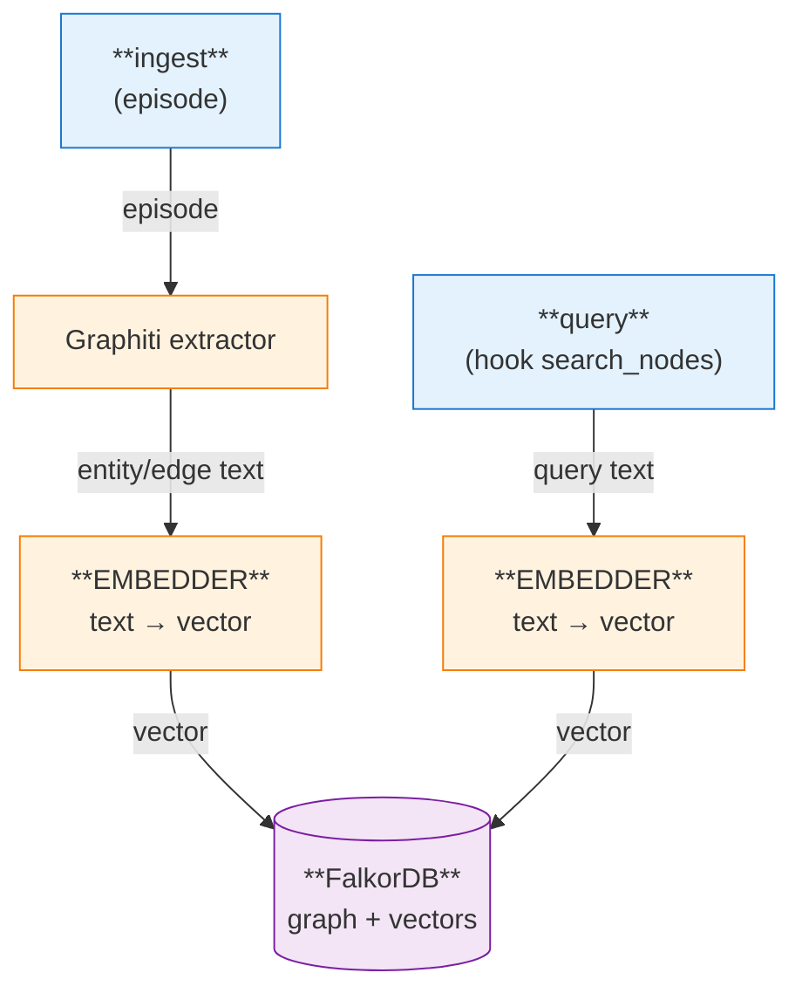
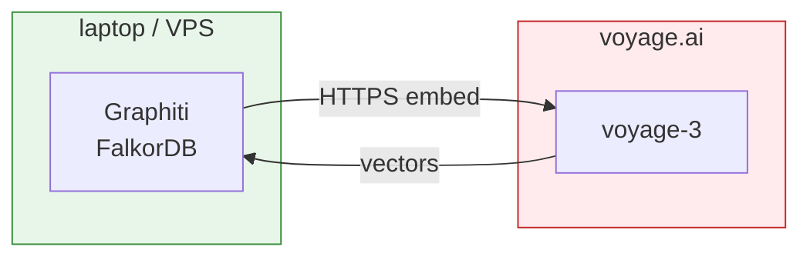
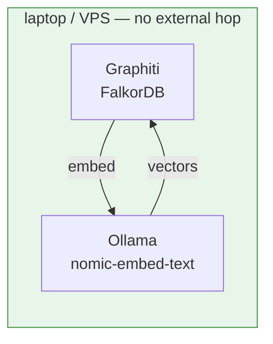
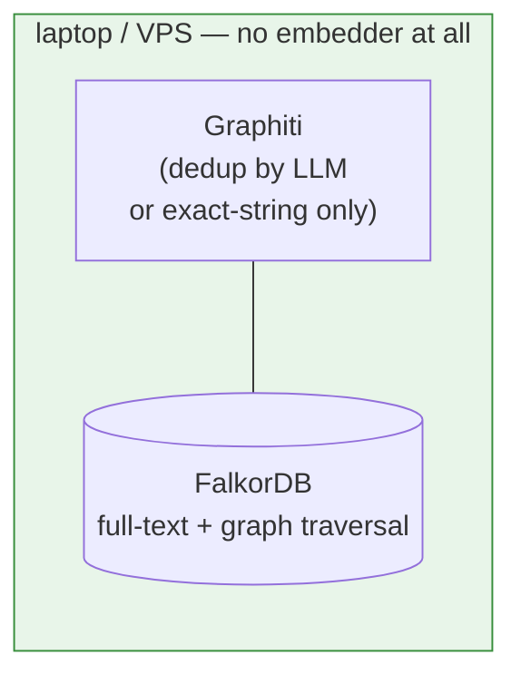

# Embedder

> **Backend changed (graph → document substrate).** The embedder choice (Voyage,
> pluggable) still holds, but it now vectorizes **chunks** stored in Postgres +
> pgvector and the **recall query** — not graphiti nodes/edges in FalkorDB. The
> Graphiti/FalkorDB plumbing in the diagrams below is historical; the embedder's
> role and alternatives are unchanged. See
> [`../brain/README.md`](../brain/README.md).

How brainbot turns text into vectors, what provider it uses today, and the two alternatives that stay on the table.

## What the embedder does

Two call sites, one provider:

1. **Ingest.** Graphiti extracts entities and edges from each episode and asks the embedder to vectorize each one. The vector is stored alongside the node in FalkorDB and used for dedup ("is this 'Steve' the same as the 'Steven L.' we already have?").
2. **Query.** When the Claude Code hook calls `search_nodes`, the search string is embedded so FalkorDB can return semantically related nodes, not just keyword matches.

## Current default: Voyage (`voyage-3`)

One external hop per ingest and per query. Search query text leaves the box. Configured with `VOYAGE_API_KEY`. Cost is ~$0.02 per 1M tokens — pennies/month at personal-brain scale.

Privacy escape hatch: set `BRAIN_INJECT_DISABLE=1` to skip the hook entirely (no query embedding, no injection).

## Alternative: co-hosted local embedder

`nomic-embed-text` (or similar) running in Ollama on the same host.

Adds one container. Embeddings are CPU-cheap (~30–80ms/query for nomic on a modern core), so the bottleneck argument that blocks co-hosted *extraction* doesn't apply here.

## Alternative: no embedder at all

Dedup falls back to exact-string match or per-candidate LLM calls. Search becomes BM25 + graph traversal — only as good as the graph is dense.

## Tradeoff table

| Dimension | Voyage (default) | Local embedder | No embedder |
|---|---|---|---|
| Setup complexity | API key only | +1 container, model pull | Nothing to run |
| External hops on query | 1 | 0 | 0 |
| Search-query privacy | Query text leaves box | Stays local | Stays local |
| Dedup quality | High (semantic) | High (semantic) | Brittle — needs LLM fallback or accepts dupes |
| Recall on fuzzy queries | Good | Good | Poor unless graph edges already connect them |
| $ per 1M tokens embedded | ~$0.02 | $0 after hardware | $0 |
| Latency added per query | ~80–150ms (network) | ~30–80ms (CPU local) | ~0 |
| Operational moving parts | Voyage account, key rotation | Ollama container, model updates, RAM | None |
| Failure mode if embedder down | Search degraded → BM25 fallback | Same, but failure is local | N/A |
| Burden shifted elsewhere | None | Memory + disk on host | Heavier extraction LLM; LLM-based dedup $$ |
| Best when… | Zero-config, don't mind the hop | Privacy matters, or Ollama already running | Use case is precise lookup, not associative recall |

## Why Voyage is the default

Phase 1 optimizes for "stand it up in an afternoon." Voyage adds one env var; the local option adds a container, a model download, and RAM headroom we haven't sized yet. Cost is trivial and latency is fine because the hook runs out-of-band of the user's typing.

## When to flip the default

Re-open the local-embedder option before Phase 2 ships: measure ingest throughput and query latency with `nomic-embed-text` co-hosted. If the gap to Voyage is small, flip the default. The no-embedder option stays as a documented escape hatch for users who want zero external dependencies and accept the recall hit.
