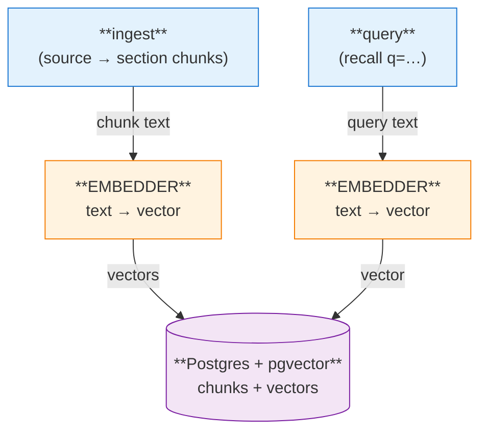

# Embedder

How brainbot turns text into vectors, what provider it uses today, and the two alternatives that stay on the table.

## What the embedder does

Two call sites, one provider:

1. **Ingest.** Each source's text is split into section chunks; the embedder vectorizes every chunk (one batched call — `brain/brain/embed.py`). The vectors are stored in `chunks.embedding` (`vector(512)`) in Postgres + pgvector.
2. **Query.** `recall` embeds the query string so the semantic arm (cosine `<=>` over the HNSW index) can find related chunks; the lexical `tsvector` arm needs no embedding.

## Current default: Voyage (`voyage-3-lite`, 512-dim)

One external hop per ingest and per query. Search query text leaves the box. Configured with `VOYAGE_API_KEY` + `BRAIN_EMBED_MODEL`; the column dim (`EMBED_DIM = 512`) must match the model — change both if you swap. Cost is ~$0.02 per 1M tokens — pennies/month at personal-brain scale.

Privacy escape hatch for the Claude Code hook: set `BRAIN_INJECT_DISABLE=1` to skip it entirely (no query embedding, no injection).

## Alternative: co-hosted local embedder

`nomic-embed-text` (or similar) running in Ollama on the same host. Adds one container; embeddings stay local. Embeddings are CPU-cheap (~30–80ms/query for nomic on a modern core), so co-hosting is viable in a way co-hosted LLM inference isn't.

## Alternative: no embedder at all

Drop the semantic arm; recall becomes pure full-text (`tsvector` BM25-style). Nothing external to call, but fuzzy queries ("what places does the user like to work from") only match on shared words.

## Tradeoff table

| Dimension | Voyage (default) | Local embedder | No embedder |
|---|---|---|---|
| Setup complexity | API key only | +1 container, model pull | Nothing to run |
| External hops on query | 1 | 0 | 0 |
| Search-query privacy | Query text leaves box | Stays local | Stays local |
| Recall on fuzzy queries | Good | Good | Poor — lexical match only |
| $ per 1M tokens embedded | ~$0.02 | $0 after hardware | $0 |
| Latency added per query | ~80–150ms (network) | ~30–80ms (CPU local) | ~0 |
| Operational moving parts | Voyage account, key rotation | Ollama container, model updates, RAM | None |
| Failure mode if embedder down | Semantic arm degraded → lexical still works | Same, but failure is local | N/A |
| Best when… | Zero-config, don't mind the hop | Privacy matters, or Ollama already running | Use case is precise lookup, not associative recall |

## Why Voyage is the default

It optimizes for "stand it up in an afternoon": one env var versus a container, a model download, and RAM headroom we haven't sized. Cost is trivial and latency is fine because the Claude Code hook runs out-of-band of the user's typing.

## When to flip the default

Re-open the local-embedder option if privacy requirements harden or an Ollama container is already running on the host: measure ingest throughput and query latency with `nomic-embed-text` co-hosted, and if the gap to Voyage is small, flip. The no-embedder option stays as a documented escape hatch for users who want zero external dependencies and accept the recall hit.
