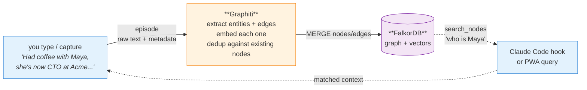

# How it all fits together

A walkthrough of one piece of data — from raw text you type, to nodes and edges in the graph, to what comes back when you (or Claude Code) ask a question. If the other docs explain *what each piece is*, this one explains *what actually happens*.

## The pipeline at a glance



Four stages: **episode in → extraction → graph storage → retrieval out**. The rest of this doc walks through each one with a real example.

---

## Stage 1: The raw input ("an episode")

The thing you write or capture is called an **episode**. It's just text plus a little metadata. There's no schema — you don't tell the system "this is a meeting" or "this is a contact." It figures that out.

A typical episode looks like this:

```json
{
  "name": "coffee with Maya 2026-05-24",
  "episode_body": "Had coffee with Maya this morning. She's now CTO at Acme — left Stripe last month. She's hiring two senior backend engineers and asked if I knew anyone good with Rust. Mentioned she's been reading a lot about graph databases lately.",
  "source": "message",
  "source_description": "captured from PWA",
  "reference_time": "2026-05-24T09:30:00Z"
}
```

That's it. No "person" field. No "company" field. No tagging. Just a paragraph that you'd write in a journal.

The same shape works for very different inputs:
- A captured thought ("I should try Voyage embeddings, OpenAI's pricing is brutal")
- A migrated Notion note (the page body becomes `episode_body`, the page title becomes `name`)
- A session summary written by Claude Code at the end of a coding session
- A status update ("OpenClaw v2 shipped today, customer #4 onboarded")

**What's stored at this point:** nothing yet. The episode is about to be handed to Graphiti.

---

## Stage 2: Graphiti extracts entities and edges

This is the part that's hard to picture without an example. Graphiti calls an LLM with a prompt that says, roughly: "Read this text. Pull out the entities (people, companies, concepts) and the relationships between them. Return structured JSON."

For the episode above, the extractor returns something like:

```json
{
  "entities": [
    { "name": "Maya",      "type": "Person" },
    { "name": "Acme",      "type": "Company" },
    { "name": "Stripe",    "type": "Company" },
    { "name": "Rust",      "type": "Technology" },
    { "name": "graph databases", "type": "Concept" }
  ],
  "edges": [
    { "source": "Maya",   "type": "WORKS_AT",       "target": "Acme",
      "fact": "Maya is CTO at Acme",
      "valid_from": "2026-05-24" },
    { "source": "Maya",   "type": "PREVIOUSLY_AT",  "target": "Stripe",
      "fact": "Maya left Stripe last month" },
    { "source": "Acme",   "type": "HIRING_FOR",     "target": "Rust",
      "fact": "Acme is hiring two senior backend engineers with Rust experience" },
    { "source": "Maya",   "type": "INTERESTED_IN",  "target": "graph databases",
      "fact": "Maya has been reading about graph databases" }
  ]
}
```

Two things to notice:

1. **The types (`Person`, `WORKS_AT`, etc.) are strings the LLM made up on the fly.** There's no schema you have to define ahead of time. If the next episode is about a sailboat, you'll get `Boat` and `OWNS` edges without any code change. (This is what "schema-flexible" means in the other docs.)
2. **Each edge carries a `fact` — the natural-language sentence it came from.** That's what shows up later when something searches the graph. You don't get "Maya WORKS_AT Acme" as the answer — you get the sentence.

Graphiti also **embeds each entity name and each fact** (via the embedder — see [embedder.md](./embedder.md)) so semantic search can find them later.

---

## Stage 3: How it lands in FalkorDB

The extracted entities and edges are merged into the graph. Before storing a new `Maya` node, Graphiti checks: do we already have a node whose name or embedding is similar enough that this is probably the same person?

**First time we see Maya:** new node created.
**Second episode that mentions "Maya Chen":** Graphiti compares embeddings, decides it's the same Maya, and attaches the new edges to the existing node instead of creating a duplicate. This is the **dedup** step the other docs reference.

After Stage 2 above, the graph looks like this (Cypher-ish notation):

```
(Maya:Person)               ──[WORKS_AT, fact: "Maya is CTO at Acme",
                                         valid_from: 2026-05-24,
                                         recorded_at: 2026-05-24T09:31Z]──▶ (Acme:Company)

(Maya:Person)               ──[PREVIOUSLY_AT, fact: "Maya left Stripe last month"]──▶ (Stripe:Company)

(Acme:Company)              ──[HIRING_FOR,    fact: "Acme is hiring two senior backend
                                                     engineers with Rust experience"]──▶ (Rust:Technology)

(Maya:Person)               ──[INTERESTED_IN, fact: "Maya has been reading about graph
                                                     databases"]──▶ (graph databases:Concept)
```

Every node also stores the embedding vector. Every edge stores **two timestamps**:

- `valid_from` / `valid_to` — when the fact is true in the world
- `recorded_at` — when the system learned it

This is the **bi-temporal** part. It matters in Stage 5 below.

---

## Stage 4: Retrieval — what `search_nodes` actually does

When the Claude Code hook fires (or the PWA chat needs context), it calls `search_nodes` with a query string. Say the query is:

> "who do I know that's hiring backend engineers"

Here's what Graphiti does:

1. **Embed the query** ("who do I know that's hiring backend engineers" → vector).
2. **Vector search** over node and edge embeddings: find the closest matches. The `HIRING_FOR` edge fact ("Acme is hiring two senior backend engineers...") is a strong hit.
3. **Graph traversal** from the hit: walk one or two hops out. From the `HIRING_FOR` edge, we reach `Acme`, and one hop further reaches `Maya` via `WORKS_AT`.
4. **Return the matched facts** as natural-language sentences:

```
- Maya is CTO at Acme
- Acme is hiring two senior backend engineers with Rust experience
- Maya left Stripe last month
```

The Claude Code hook takes that result, packs it into ≤2KB of context, and prepends it to your prompt. So when you type "draft a referral note for someone hiring Rust devs," Claude already knows Maya exists, where she works, and what she's hiring for — without you mentioning her.

This is what people mean when they say "the brain shows up ambiently." You didn't search for Maya. You searched for the *concept*, and the graph connected the dots.

---

## Stage 5: A correction — why bi-temporal matters

Two weeks later, you capture:

```
"Actually Maya isn't at Acme anymore — she joined a stealth startup last week.
Can't say which one yet."
```

Graphiti extracts:

```json
{
  "edges": [
    { "source": "Maya", "type": "WORKS_AT", "target": "<unknown stealth startup>",
      "fact": "Maya joined a stealth startup",
      "valid_from": "2026-06-07" }
  ]
}
```

When this edge merges into the graph, Graphiti notices it **contradicts** the existing `Maya WORKS_AT Acme` edge. Instead of overwriting (which would lose the history) or appending (which would leave both as "true"), it:

- Sets `valid_to: 2026-06-07` on the old `WORKS_AT Acme` edge.
- Creates the new `WORKS_AT <stealth startup>` edge with `valid_from: 2026-06-07`.

Both edges still exist. Queries get the right answer depending on what they ask:

- "Where does Maya work now?" → only edges with `valid_to: null` → stealth startup.
- "Where did Maya work in May 2026?" → edges where `valid_from ≤ 2026-05-01 ≤ valid_to` → Acme.

In a turn-shaped vector store, the old "Maya is CTO at Acme" sentence would just sit in the embedding space and keep surfacing forever, even though it's wrong now. That's the failure mode bi-temporal facts prevent.

---

## What Graphiti is actually doing for you

It's easy to look at the JSON above and think "I could write that with a few LLM calls and a Postgres table." You could! Graphiti is the bundle of decisions that's tedious to make correctly:

| What you'd build yourself | What Graphiti gives you |
|---|---|
| Prompt the LLM to extract entities + edges | Done, with a prompt tuned for graph extraction |
| Embed each entity and edge | Done, provider-pluggable |
| Decide "is this Maya the Maya we already have?" (dedup) | Done, embedding-similarity + name match with thresholds |
| Store bi-temporal facts cleanly | Done, `valid_from`/`valid_to`/`recorded_at` on every edge |
| Detect contradictions and invalidate old facts | Done, this is the killer feature |
| Search (vector + BM25 + graph walk hybrid) | Done, one `search_nodes` call |
| Expose it over MCP for Claude Code | Done, official MCP server |
| Speak Cypher to a graph DB so you can poke around manually | Done, FalkorDB-backed |

The "extraction + dedup + bi-temporal correction" trio is the value. Each piece is doable alone; getting all three to work together without race conditions or stale state is the part you don't want to reinvent.

---

## Where to go from here

- [memory-model.md](./memory-model.md) — why graph instead of turn-shaped at all
- [graph-engine.md](./graph-engine.md) — Graphiti's role specifically
- [graph-database.md](./graph-database.md) — why FalkorDB underneath
- [embedder.md](./embedder.md) — the vectorization step in Stage 2/4
- [mcp-integration.md](./mcp-integration.md) — how Claude Code calls `search_nodes` in Stage 4
- [human-edit-surface.md](./human-edit-surface.md) — what to do when Stage 2 extraction is wrong
